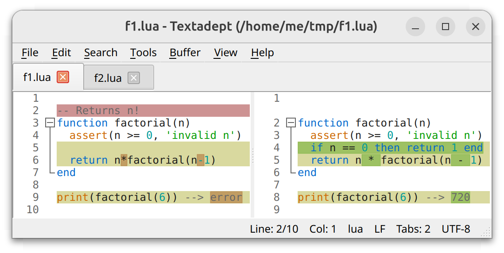
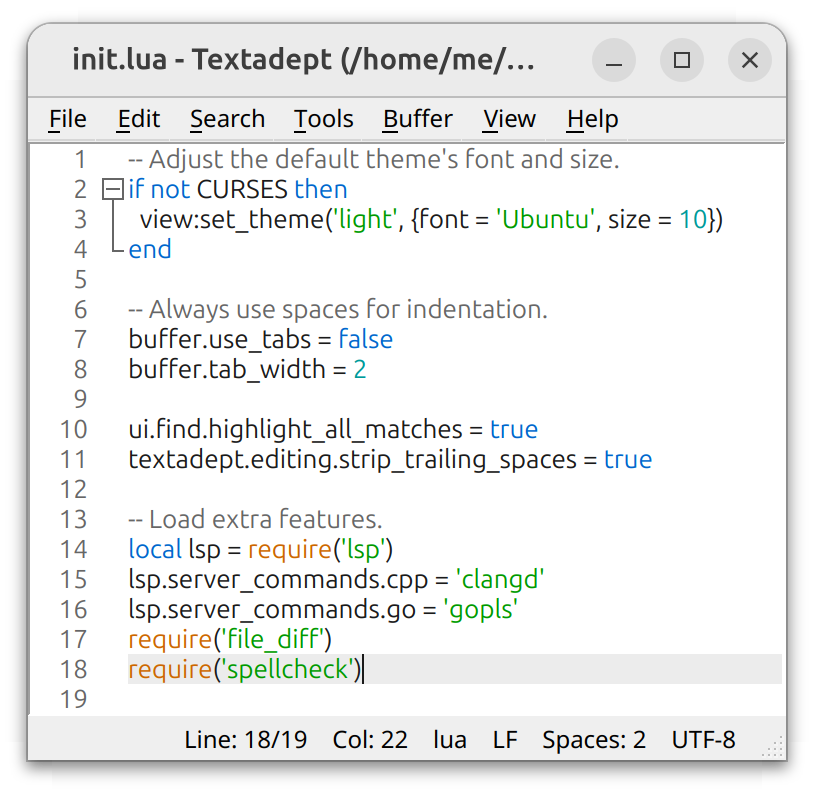
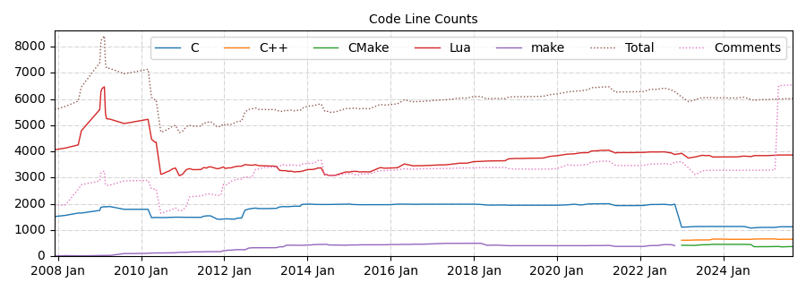

# Textadept

Textadept is a fast, minimalist, and remarkably extensible cross-platform text editor for programmers.

## Kindle usage notes

Textadept is an advanced text editor you can use on a jailbroken Kindle. Currently it works on ARMHF firmwares (version 5.16.2+). It has graphical interface that uses GTK and text interface that can be run from Kterm.

It is strongly recommended to use an external Bluetooth keyboard for typing. Use the **[Kindle Hid Passthrough](https://github.com/kbarni/kindle-hid-passthrough/releases/latest)** library to connect bluetooth keyboards.

If you don't have a BT keyboard, launch the Textadept without external keyboard from KUAL. Otherwise you can use either the GUI version, or the terminal version without on-screen keyboard. I recommend using the terminal version, as the GUI version lags in the e-ink displays.

One shortcut to remember: **Ctrl+P** will bring up the **Select command** dialog for quick access to all the commands.

Read the [Manual][] and the [Lua API Docs][] for more advanced usage.

## Kindle porting notes

**Textadept** is a desktop-grade text editor - at par with its more popular siblings like VSCode, with a small but dedicated user base. This is the full port for Kindle, nothing removed, no compromises. You can use the configuration files and scripts from the desktop version to get the same experience!

The current version (12.9) was adapted to cross-compile for Kindle, with some tweaks for the e-ink display and the Kindle libraries.

Clone the repo, install a cross-compile toolchain and create a cross-compile cmake config file. You might need to build the *curses* library if it's not present in the toolchain.

```bash
mkdir build
cd build
cmake .. -DCMAKE_TOOLCHAIN_FILE=../kindle-toolchain.cmake
```

*Now copy the patched Scintilla files from the `patchedfiles` folder to the original location in the build folder.* Then, you can build textadept:

```
make -j 8
```

*Final note: Textadept 13 (in development when I'm writing this) seems to have transferred to the C17 standard, unsupported by the Kindle system libraries. So this is probably the last version with Kindle port.*

---

Quick links: [Download][] \| [Manual][] \| [Lua API Docs][] \| [Project Page][]

<a href="assets/images/windows.png"></a>
<a href="assets/images/macos.png"></a>

<a href="assets/images/linux.png"></a>
<a href="assets/images/terminal.png"></a>

[Download]: #download
[Manual]: manual.md
[Lua API Docs]: api.md
[Project Page]: https://github.com/orbitalquark/textadept

## Features

- Traditional desktop application written in a combination of C, C++, and [Lua][].
- Runs on Windows, macOS, Linux, and BSD.
- Self-contained executables -- no installation necessary.
- User-friendly graphical and terminal interfaces with sensible defaults.
- Support for over 100 programming languages.
- Multiple carets and selections.
- Unlimited split views.
- Configurable key bindings, including language-specific keys, key chains, and key modes.
- Snippets, both generic and language-specific, and support for nested snippets.
- Invoke shell commands for running code, building projects, and executing tests.
- Almost every aspect of the editor can be scripted, extended, and customized with Lua.
- Does not connect to the internet -- *it's just a text editor!*

<a href="assets/images/textadept.png"></a>

[Lua]: https://lua.org

## Requirements

Textadept's pre-built binaries require the following:

- Windows 10+ (64-bit or ARM)
- macOS 11+
- Linux: [Qt][] 5 or [GTK][] 3 for the GUI version, and [ncurses][] for the terminal version.

You can [compile](#compile) Textadept from source for use with different UI library versions,
such as Qt 6 and GTK 2.24.

**Note:** Lua and other [third-party dependencies][] are compiled into the application itself,
and a Qt runtime is distributed with Windows and macOS builds.

[Qt]: https://www.qt.io/
[GTK]: https://gtk.org
[ncurses]: https://invisible-island.net/ncurses/ncurses.html
[third-party dependencies]: manual.html#technologies

## Download

You can download pre-built binaries for various platforms, as well as source code from the
links below.

Stable Release<br/>(12.9) | Beta Release<br/>(N/A) | Experimental<br/>nightly build
-|-|-
[Windows][stable win] | | [Windows][nightly win]
[macOS][stable mac] | | [macOS][nightly mac]
[Linux x64][stable linux] / [ARM][stable arm] | | [Linux x64][nightly linux] / [ARM][nightly arm]
[Extra modules][stable modules] | | [Extra modules][nightly modules]
[Source code][stable source] | | [Source code][nightly source]

A list of all released versions is [here][all versions] along with their release notes.

[stable win]: https://github.com/orbitalquark/textadept/releases/download/textadept_12.9/textadept_12.9.win.zip
[stable mac]: https://github.com/orbitalquark/textadept/releases/download/textadept_12.9/textadept_12.9.macOS.zip
[stable linux]: https://github.com/orbitalquark/textadept/releases/download/textadept_12.9/textadept_12.9.linux.tgz
[stable arm]: https://github.com/orbitalquark/textadept/releases/download/textadept_12.9/textadept_12.9.linux.arm.tgz
[stable modules]: https://github.com/orbitalquark/textadept/releases/download/textadept_12.9/textadept_12.9.modules.zip
[stable source]: https://github.com/orbitalquark/textadept/archive/refs/tags/textadept_12.9.zip
[nightly win]: https://github.com/orbitalquark/textadept/releases/download/textadept_nightly/textadept_nightly.win.zip
[nightly mac]: https://github.com/orbitalquark/textadept/releases/download/textadept_nightly/textadept_nightly.macOS.zip
[nightly linux]: https://github.com/orbitalquark/textadept/releases/download/textadept_nightly/textadept_nightly.linux.tgz
[nightly arm]: https://github.com/orbitalquark/textadept/releases/download/textadept_nightly/textadept_nightly.linux.arm.tgz
[nightly modules]: https://github.com/orbitalquark/textadept/releases/download/textadept_nightly/textadept_nightly.modules.zip
[nightly source]: https://github.com/orbitalquark/textadept/archive/refs/tags/textadept_nightly.zip
[all versions]: https://github.com/orbitalquark/textadept/releases

**Note:** while Textadept contains plenty of built-in productivity tools, some extra features and
functionality are available as optional modules in the "Extra modules" links above. This includes:

- [Language debuggers](https://github.com/orbitalquark/textadept-debugger)
- [File comparison](https://github.com/orbitalquark/textadept-file-diff)
- [Source code formatting](https://github.com/orbitalquark/textadept-format)
- [Language Server Protocol client](https://github.com/orbitalquark/textadept-lsp)
- [Scratch buffers](https://github.com/orbitalquark/textadept-scratch)
- [Spell checking](https://github.com/orbitalquark/textadept-spellcheck)

<a href="assets/images/lsp.png"></a>
<a href="assets/images/diff.png"></a>

## Install and Use

Simply unpack the pre-built binary archive anywhere you have permission to and run one of the following executables:

Platform | GUI version | Terminal version
-|-|-
Windows | *textadept.exe* | *textadept-curses.exe*
macOS | *Textadept.app* <br/>*ta* (shell script)| *Textadept.app/Contents/MacOS/textadept-curses*
Linux | *textadept* (Qt version)<br/> *textadept-gtk* (GTK version) | *textadept-curses*

The "Help > Show Manual" menu item, or the `F1` keyboard shortcut opens Textadept's comprehensive
user manual. There is also an [online version][manual]. The manual covers all of Textadept's
main features, including installation, usage, configuration, theming, scripting, and compiling
from source.

The "Help > Show LuaDoc" menu item, or the `Shift+F1` keyboard shortcut opens Textadept's extensive
API reference for users interested in scripting the editor. There is also an [online version][api].

[manual]: manual.md
[api]: api.md

If you downloaded the optional set of modules, unpack it into the *.textadept/* directory in
your home folder (keeping the top-level *modules/* directory intact). You could instead unpack
it into Textadept's directory (thus merging the two *modules/* directories), but this is not
recommended, as it may make upgrading more difficult.

**Note:** Textadept generally does not auto-load modules. To use any of modules from the optional
set, select the "Edit > Preferences", use Lua's `require()` function for each module to load,
save the file, and restart Textadept. For example:

```lua
require('lsp')
require('file_diff')
require('spellcheck')
```

<a href="assets/images/settings.png"></a>

## Compile

Compiling Textadept from source requires the following:

- [CMake][] 3.22+
- A C and C++ compiler, such as:
	- [GNU C compiler][] (*gcc*) 7.1+
	- [Microsoft Visual Studio][] 2019+
	- [Clang][] 13+
- A UI toolkit (at least one of the following):
	- [Qt][] 5.15+ development libraries for the GUI version
	- [GTK][] 2.24+ development libraries for the GUI version
	- [ncurses][](w) development libraries (wide character support) for the terminal version

Basic procedure:

1. Configure CMake by pointing it to Textadept's source directory (where *CMakeLists.txt* is),
	specify a directory to build in, and optionally specify a directory to install to. CMake will
	determine what UI toolkits are available and fetch third-party build dependencies.
	<br/><a href="assets/images/compile.png"></a>
2. Build Textadept.
3. Either copy the built binaries to Textadept's source directory or use CMake to install it.

For example:

```bash
cmake -S . -B build_dir -D CMAKE_BUILD_TYPE=RelWithDebInfo \
	-D CMAKE_INSTALL_PREFIX=build_dir/install
cmake --build build_dir -j # compiled binaries are in build_dir/
cmake --install build_dir # self-contained installation is in build_dir/install/
```

**Note:** if you would like to build the nightly development version of Textadept, enable the
`NIGHTLY` option during the configuration phase (e.g. `-D NIGHTLY=1`).

The "[Compiling][]" section of the manual contains more information about this process.

[CMake]: https://cmake.org
[GNU C compiler]: https://gcc.gnu.org
[Microsoft Visual Studio]: https://visualstudio.microsoft.com/
[Clang]: https://clang.llvm.org/
[Qt]: https://www.qt.io
[GTK]: https://gtk.org
[ncurses]: https://invisible-island.net/ncurses/ncurses.html
[Compiling]: manual.html#compiling

## Support

Textadept is an open-source project, released under the MIT License.

- [Manual](manual.md)
- [Lua API Documentation](api.md)
- [Project page](https://github.com/orbitalquark/textadept)
- [Issue tracker](https://github.com/orbitalquark/textadept/issues)
- [Discussions](https://github.com/orbitalquark/textadept/discussions)
- [Wiki](https://github.com/orbitalquark/textadept/wiki)
- [Frequently Asked Questions](faq.md)
- [Credits](thanks.md)

You can contact me personally at code att foicica.com.

<a href="assets/images/loc.png"></a>
