# Textadept 12.9 Manual

**Contents**

1. [Introduction](#introduction)
2. [Getting Started](#getting-started)
3. [User Interface](#user-interface)
4. [Working with Files and Projects](#working-with-files-and-projects)
5. [Adept Editing](#adept-editing)
6. [Compile, Run, Build, and Test](#compile-run-build-and-test)
7. [Modules](#modules)
8. [Themes](#themes)
9. [Scripting](#scripting)
10. [Compiling](#compiling)
11. [Appendix](#appendix)

## Introduction

### Overview

<a href="assets/images/linux.png">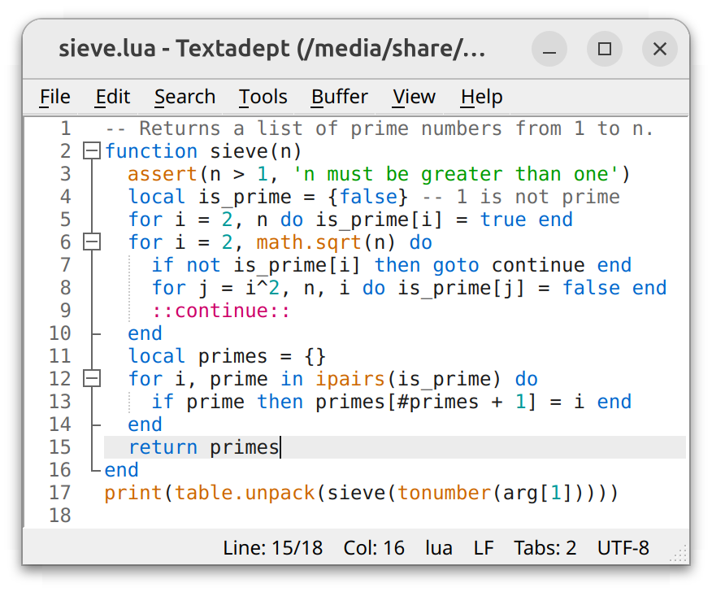</a>
<a href="assets/images/terminal.png">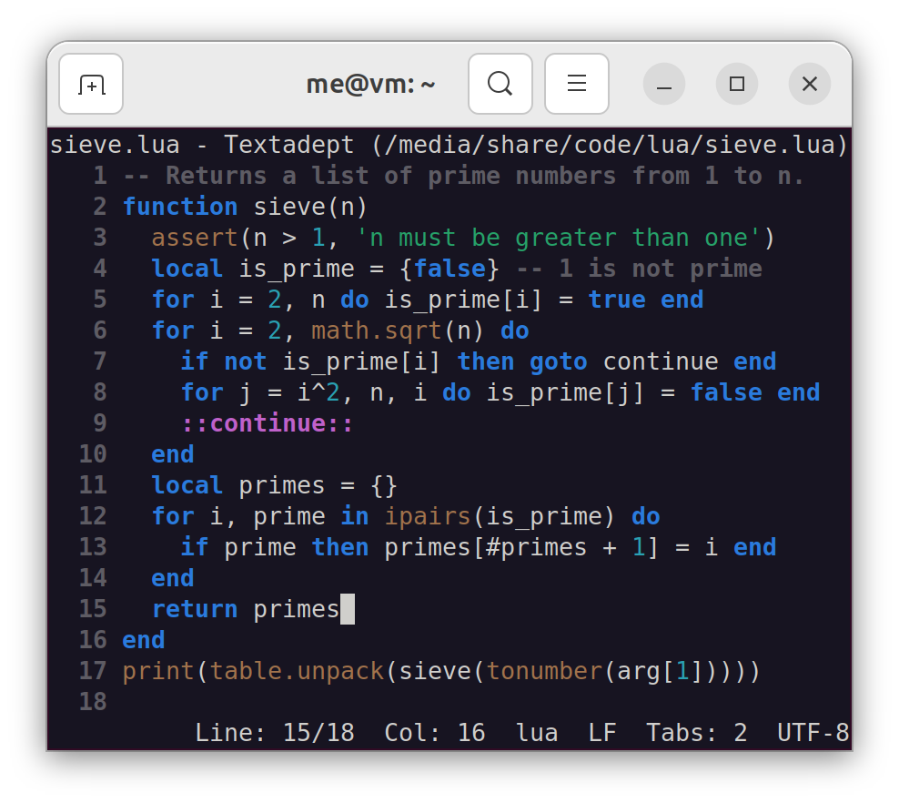</a>

Textadept is a fast, minimalist, and remarkably extensible cross-platform text editor for
programmers. It is a traditional desktop application and has both a graphical user interface
(GUI), and a terminal user interface (TUI). Written in a combination of C, C++, and [Lua][],
the editor is extremely light on resources and very responsive.

[Lua]: https://www.lua.org

### About This Manual

This manual uses the following typographical conventions:

- *Italic*: Used for filenames.
- `Constant width`: Used for environment variables, command line arguments, shell code, key
	bindings, and Lua code, including functions, tables, and variables.

Key bindings use the following modifier key representations:

Modifier | Windows, Linux, and BSD| macOS | Terminal
-|-|-|-
Control | `Ctrl` | `^` | `^`
Alt | `Alt` | `⌥` | `M-`
Command | N/A | `⌘` | N/A
Shift | `Shift` | `⇧` | `S-`

This manual uses the following terminology:

- *buffer*: An object that contains editable text. Some other applications call this object a
	document or file.
- *view*: An object that displays a single buffer. Some other applications call this object
	a window.
- *caret*: The visual that represents the text insertion point. It is usually a blinking
	line. Some other applications call this object a cursor.
- *module*: A package of Lua code that provides functionality for Textadept.
- *lexer*: A Lua module that highlights the syntax of source code written in a particular
	programming language. Textadept refers to a programming language by its lexer's name.
- *~/.textadept/*: Platform-specific directory where Textadept stores all settings and user data.

	Platform | Directory
	-|-
	Windows | *C:\\Users\\username\\.textadept\\*
	macOS | */Users/username/.textadept/*
	Linux | */home/username/.textadept/*
	BSD | */home/username/.textadept/*

	(Substitute *username* for your actual user name.)

Finally, this manual assumes you are familiar enough with the [Lua][] programming language that
you can understand the simple code samples spread throughout the manual's contents. If you would
like to quickly get up to speed, or need a refresher, the [Lua Quick Reference][] may be of help.

[Lua Quick Reference]: https://orbitalquark.github.io/lua-quick-reference

## Getting Started

### Requirements

Textadept's pre-built binaries require the following:

- Windows 10+ (64-bit or ARM)
- macOS 11+
- Linux: [Qt][] 5 or [GTK][] 3 for the GUI version, and [ncurses][] for the terminal version.

You can [compile](#compiling) Textadept from source for use with different UI library versions,
such as Qt 6 and GTK 2.24.

[Qt]: https://www.qt.io/
[GTK]: https://gtk.org
[ncurses]: https://invisible-island.net/ncurses/ncurses.html

### Download

Textadept releases and their release notes can be found [here][all releases]. Select the
appropriate binary package for your platform. You can optionally download a companion set of
modules that provide extra features and functionality for the core application.

**Windows Note:** antivirus software may flag the Windows package as containing a virus or
malware. This is a false-positive, caused by Textadept's terminal version executable, which is
a console application.

**BSD Note:** binary packages for BSD are not available. You will have to [compile](#compiling)
Textadept manually. Installing and running Textadept will be similar to the Linux instructions
below.

[all releases]: https://github.com/orbitalquark/textadept/releases

### Installation

Installing Textadept is simple and easy -- no administrator privileges necessary. On Windows and
Linux, simply unpack the archive anywhere. On macOS, unpack the archive and move *Textadept.app*
to your user or system *Applications/* folder like any other macOS application. The macOS
archive also contains a *ta* script for launching Textadept from the command line. You can put
this script somewhere in your `$PATH` (e.g. */usr/local/bin/*), but this is optional.

If you downloaded Textadept's extra set of modules, unpack it into *~/.textadept/* (keeping
the top-level *modules/* directory intact). If *~/.textadept/* does not exist, either create
it manually, or [run Textadept](#running), which creates it for you. You could instead unpack
the extra modules into Textadept's directory (thus merging the two *modules/* directories),
but this is not recommended, as it may make upgrading more difficult

**Note:** Textadept generally does not auto-load modules, so you will need to load any extra
modules you installed manually. The [modules](#modules) section describes this process.

### Updating

Textadept does not have an auto-update process, as it does not connect to the internet (it is
just a text editor). Instead, download new versions as they release (typically the first day of
the month every month or two), and unpack or copy its contents into your current installation,
overwriting it.

### Running

<a href="assets/images/windows.png">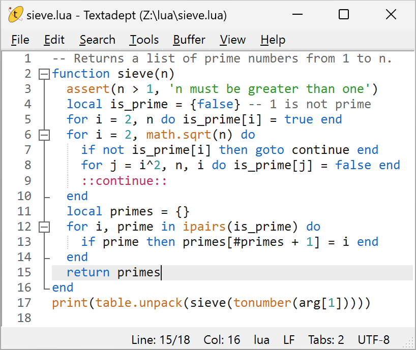</a>
<a href="assets/images/macos.png">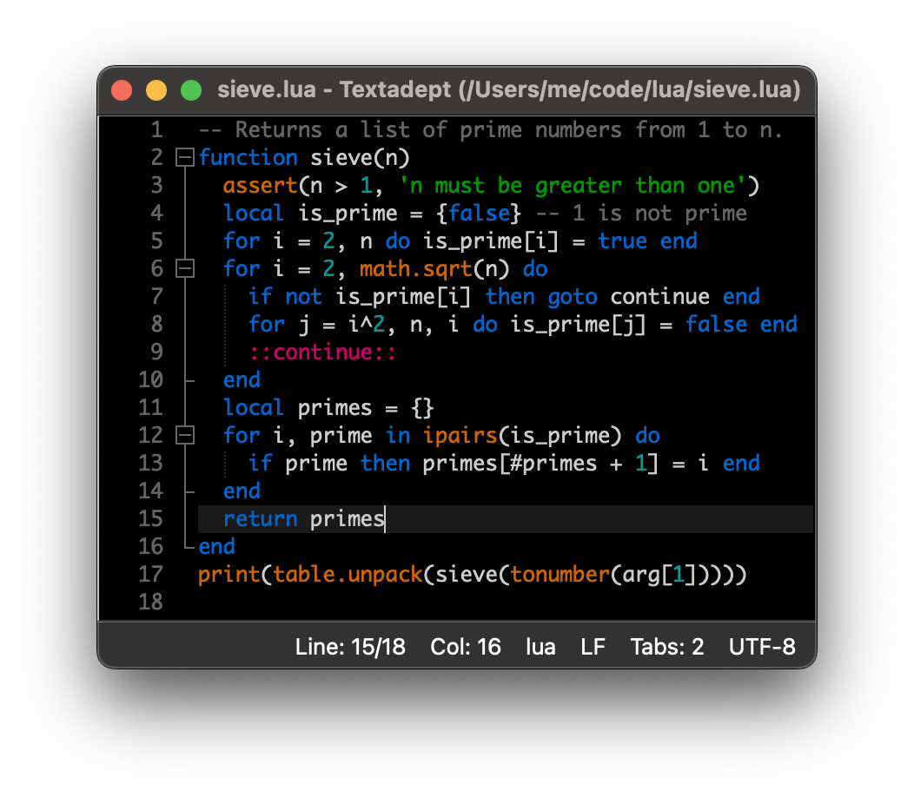</a>
<a href="assets/images/linux.png"></a>
<a href="assets/images/terminal.png"></a>

Run Textadept on Windows by double-clicking *textadept.exe* or *textadept-curses.exe*. On
macOS, double-click *Textadept.app* or invoke the *ta* script from the command line. On Linux,
invoke *textadept*, *textadept-gtk*, or *textadept-curses* from a file browser, run dialog,
terminal, etc.

**Linux Note:** it is not possible to provide a single Textadept binary that runs correctly
on all systems. If the editor will not start on your machine, you must [compile](#compiling)
it manually.

For better platform integration:

- Windows: create shortcuts to the executables on the Windows Desktop, Start
Menu, Quick Launch toolbar, etc.
- macOS: pin the app to your dock.
- Linux: use Textadept's *src/textadept.desktop*, *src/textadept-gtk.desktop*, and
	*src/textadept-curses.desktop* files by picking one of the following:

	1. Create a symbolic link to the executables from somewhere in your `$PATH`
	  (e.g. */usr/local/bin/*) and then copy those desktop files to a Freedesktop.org-specified
	  applications directory on your system (e.g. */usr/local/share/applications* or
	  *~/.local/share/applications/*).
	2. Edit those desktop files with the absolute path to the Textadept executables and then copy
	  those desktop files to an applications directory.
	3. Edit those desktop files with the absolute path to the Textadept executables and then
	  double-click the desktop file you want to run.

	Picking 1 or 2 shows Textadept in your desktop environment's menu system (GNOME, KDE, XFCE,
	etc.).

	You can properly set Textadept's icon by either copying Textadept's
	*core/images/textadept.svg* to a Freedesktop.org-specified "hicolor" theme directory
	(e.g. */usr/share/icons/hicolor/scalable/apps* or *~/.local/share/icons/hicolor/scalable/apps*),
	or by editing Textadept's desktop files to set "Icon" to the absolute path to
	*core/images/textadept.svg*.

	**Note:** if you compiled Textadept, using CMake to install it will do all this for you.

Textadept accepts the following command line arguments:

Option | Description
-|-
`-e <code>`, `--execute <code>` | Run the given Lua code
`-f`, `--force` | Forces unique instance
`-h`, `--help` | Shows this<sup>a</sup>
`-l <line>`, `--line <line>` | Jumps to a line in the previously opened file
`-L <script>`, `--lua <script>` | Runs the given file as a Lua script and exits
`-n`, `--nosession` | No state saving/restoring functionality
`-p`, `--preserve` | Preserve ^Q and ^S flow control sequences<sup>b</sup>
`-s <name>`, `--session <name>` | Loads the given session on startup<sup>c</sup>
`-u <dir>`, `--userhome <dir>` | Sets alternate user data directory
`-v`, `--version` | Prints version and copyright info<sup>a</sup>
`-` | Read stdin into a new buffer<sup>a</sup>

<sup>a</sup>The terminal version does not support these.<br/>
<sup>b</sup>Non-Windows terminal version only.<br/>
<sup>c</sup>Qt interprets `--session` for itself, so `-s` must be used.

**Note:** the `-L` and `--lua` options instructs Textadept to function as a standalone Lua
interpreter. All other command line options have no effect, but they are available to the script
via the global `arg` table. Textadept defines `arg` as it is described in the Lua manual: the
script name goes at index 0, the first argument after the script name goes at index 1, and so
on; arguments before the script name (i.e. the Textadept binary and the `-L` or `--lua` option)
go to negative indices. Textadept does not emulate Lua's command line options or its default
`package.path` and `package.cpath` settings.

Textadept also accepts files and projects to open from the command line. For example:

```bash
textadept /path/to/file1 ../relative/path/to/file2
textadept /path/to/project/ relative/path/to/file1 relative/file2
```

Unless you specify a filename as an absolute path, Textadept assumes it is relative to the
application's current working directory (cwd). Textadept's cwd is initially the command line's
cwd. (If Textadept is not being run from the command line, its cwd is unspecified.) If a project
directory is specified, it becomes Textadept's cwd, but Textadept does not open any files in
that directory. If multiple project directories are specified, the last one becomes the cwd.

By default, Textadept saves its state when it exits. If you do not give Textadept any files or
projects to open, do not specify a session to load, and do not disable session functionality,
the editor tries to restore its state at last exit.

The GUI version of Textadept is a single-instance application -- if you invoke it again while it
is already open (e.g. opening a file from a file browser or command line), the action happens in
the original instance. Pass the `-f` or `--force` command line flag to override this behavior and
run a new instance of Textadept. You can disable this behavior on Windows by creating a shortcut
to *textadept.exe* that passes this flag and use that shortcut to run Textadept. Similarly on
Linux, you can set up your button or menu launchers to pass the flag to the *textadept* or
*textadept-gtk* executables.

Textadept can run as a portable application, for example from a USB flash drive. Normally, all
settings and user data is stored in *~/.textadept/*. However, you can override this user directory
using the `-u` or `--userhome` command line option. For example, invoking *textadept.exe* with
the command line arguments `-u userdata` will read from and store settings and user data to a
*userdata/* directory located inside an installation of Textadept. You can create a Windows
shortcut that passes these command line arguments to the Textadept executable and use that
shortcut to run Textadept portably.

### Preferences

The special file *~/.textadept/init.lua* is a Lua script where you specify your editor preferences
and customize what the application does when it starts. Open it using the "Edit > Preferences"
menu item. It is initially empty. You can use this file to:

- Set a color theme and change the default font.
- Specify default buffer and view settings.
- Change the settings of existing modules.
- Load custom modules.
- Configure key bindings.
- Extend menus.
- Enhance support for file types and programming languages.
- Run arbitrary Lua code.
- And more!

These topics will be covered throughout this manual. Textadept's comprehensive [Lua API][]
includes all configurable settings for buffers, views, and modules.

Here is a sample *~/.textadept/init.lua* for illustration:

```lua
-- Adjust the default theme's font and size.
if not CURSES then
	view:set_theme('light', {font = 'Monospace', size = 12})
end

-- Always use spaces for indentation.
io.detect_indentation = false
buffer.use_tabs = false
buffer.tab_width = 2

-- Always strip trailing spaces on save, automatically highlight the current
-- word, and use C89-style block comments in C code.
textadept.editing.strip_trailing_spaces = true
textadept.editing.highlight_words = textadept.editing.HIGHLIGHT_CURRENT
textadept.editing.comment_string.c = '/*|*/'

-- Create a key binding to the "Edit > Preferences" menu item.
if not OSX and not CURSES then
	keys['ctrl+,'] = textadept.menu.menubar['Edit/Preferences'][2]
end

-- Load an external module and bind a key to it.
local lsp = require('lsp')
keys['ctrl+f12'] = lsp.goto_declaration

-- Recognize .luadoc files as Lua code.
lexer.detect_extensions.luadoc = 'lua'

-- Change the run commands for Lua and Python
textadept.run.run_commands.lua = 'lua5.1 "%f"'
textadept.run.run_commands.python = 'python3 "%f"'

-- Always use PEP-8 indentation style for Python files, and spaces for YAML files.
events.connect(events.LEXER_LOADED, function(name)
	if name == 'python' or name == 'yaml' then
		buffer.use_tabs = false
		buffer.tab_width = 4
	end
end)
```

**Note:** *~/.textadept/init.lua* must not call any functions that create buffers and views
(e.g. `ui.print()`, `io.open_file()`, and `buffer.new()`) at file-level scope. Buffers and
views can only be created within functions assigned to keys, associated with menu items, or
connected to events.

[Lua API]: api.html

## User Interface

<a href="assets/images/textadept.png">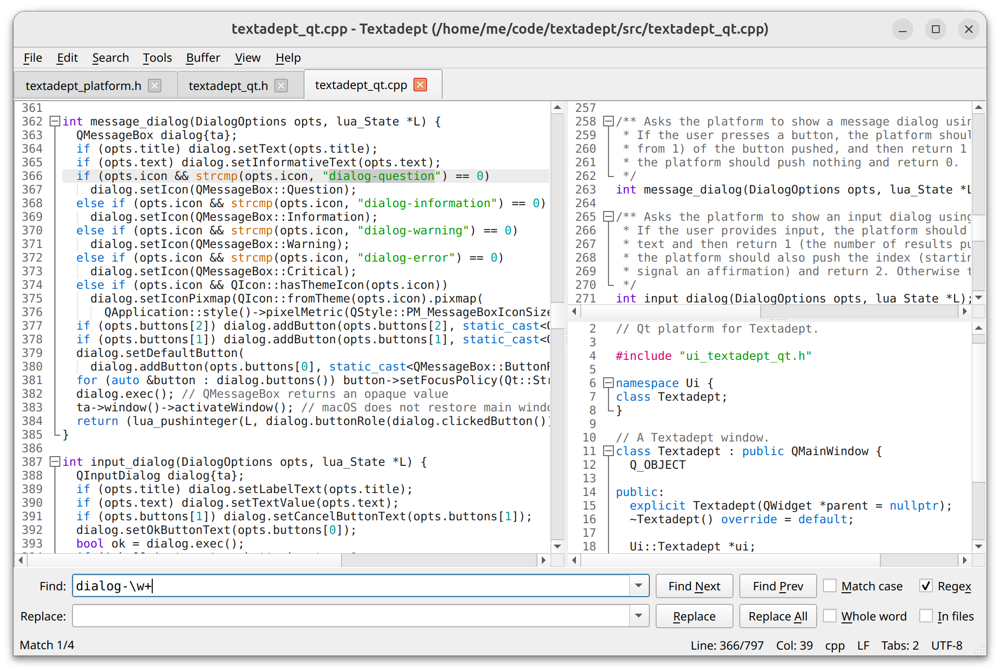</a>

Textadept's user interface is sleek and simple. It consists of:

- Completely customizable menu bar
- Scrollable tab bar
- Editor view with unlimited split views
- Find & replace pane (initially hidden)
- Command entry (initially hidden)
- Statusbar and document statusbar

**Terminal version note:** the menu bar and tab bar are not supported.

The titlebar shows the name and path of the current, active buffer. A '\*' character, if present,
indicates there are unsaved changes in that buffer.

Textadept's user interface has been translated into a few different languages. When the application
starts, it attempts to auto-detect your language settings by reading from the `$LANG` environment
variable. If this fails, or if the editor does not support your language, it falls back on
English. You can manually set your locale by copying one of the locale configuration files from
Textadept's *core/locales/* to your *~/.textadept/* directory and renaming it *locale.conf*. If
you would like to translate Textadept into your language, please translate the English messages
in *core/locale.conf* and send me (see the bottom of *README.md*) the modified file for inclusion
in a future release.

### Menu

The menu bar provides access to nearly all of Textadept's editing features. Almost every
menu item has a key binding for quick access. Some languages and platforms also provide menu
mnemonics for opening and selecting menu items. For example, on Windows and Linux/BSD with
the English language, `Alt+E` opens the "Edit" menu, `S` opens the "Select" sub-menu, and `L`
invokes the "Select Line" menu item.

Textadept's menu items are also accessible in the form of a searchable dialog via `Ctrl+P`
on Windows and Linux/BSD, `⌘P` on macOS, and `^P` in the terminal version. (Despite the fact
that the terminal version does not have a menu, it does have this dialog.) Typing part of the
name of any command in the dialog filters the list, with spaces being wildcards. The arrow
keys move the selection up and down. Pressing `Enter`, selecting `OK`, or double-clicking on a
command invokes it. (The terminal version requires pressing `Enter`.) Using this dialog is an
alternative to navigating the menus or remembering key bindings. You can also use it to quickly
look up key bindings for particular commands.

<a src="assets/images/menudialog.png">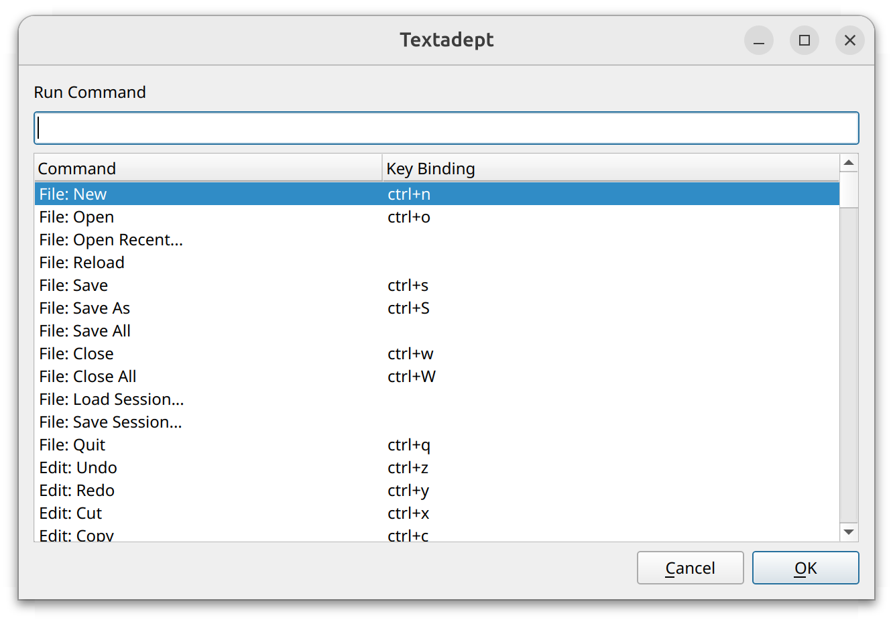</a>
<a src="assets/images/menudialogcurses.png">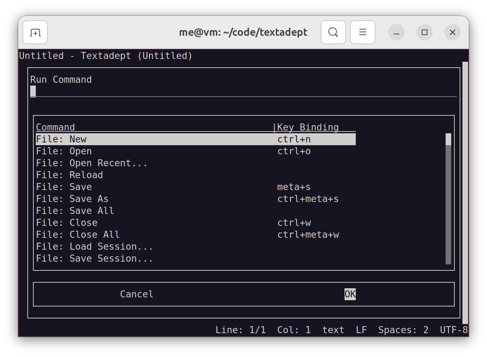</a>

**Note:** some commands have more than one key binding, but only one of those bindings (chosen
at random) is shown in the menu and dialog.

You can extend Textadept's menu (and dialog) with your own menus, sub-menus, and menu items by
modifying the [`textadept.menu.menubar`][] table. For example, in your *~/.textadept/init.lua*:

```lua
local tools = textadept.menu.menubar['Tools']
tools[#tools + 1] = {''} -- separator
tools[#tools + 1] = {'Reset L&ua State', reset} -- mark 'u' as the mnemonic
```

[`textadept.menu.menubar`]: api.html#textadept.menu.menubar

### Tab Bar

The tab bar displays all of Textadept's open buffers by name, though it is only visible when
two or more buffers are open. A '\*' character, if present, indicates there are unsaved changes
in the marked buffer. When two or more views are open, the active tab applies to the active
view, and clicking on a tab switches to its buffer in that view. Right-clicking on the tab bar
brings up a context menu. Rearrange tabs by clicking, dragging, and dropping them. Toggle the
visibility of the tab bar (as long as more than one buffer is open) using the "Buffer > Toggle
Tab Bar" menu item. Turn off the tab bar completely by setting [`ui.tabs`][]. For example,
in your *~/.textadept/init.lua*:

```lua
ui.tabs = false
```

[`ui.tabs`]: api.html#ui.tabs

Cycle to the next buffer via `Ctrl+Tab` or `Ctrl+PgDn` on Windows and Linux/BSD, `^⇥` or
`⌘⇟`on macOS, and `M-PgDn` in the terminal version. Cycle to the previous buffer via
`Ctrl+Shift+Tab` or `Ctrl+PgUp`, `^⇧⇥` or `⌘⇞`, and `M-PgUp`.

Textadept's tabs are also accessible in the form of a searchable dialog via `Ctrl+B` on Windows
and Linux/BSD, `⌘B` on macOS, and `^B` in the terminal version. (Despite the fact that the
terminal version does not have a tab bar, it does have this dialog.) The dialog displays a
list of currently open buffers. Typing part of any filename filters the list, with spaces
being wildcards. The arrow keys move the selection up and down. Pressing `Enter`, selecting
`OK`, or double-clicking on a buffer switches to it. (The terminal version requires pressing
`Enter`.) This feature is particularly useful when many files are open, and navigating through
the tab bar is tedious.

<a href="assets/images/bufferbrowser.png">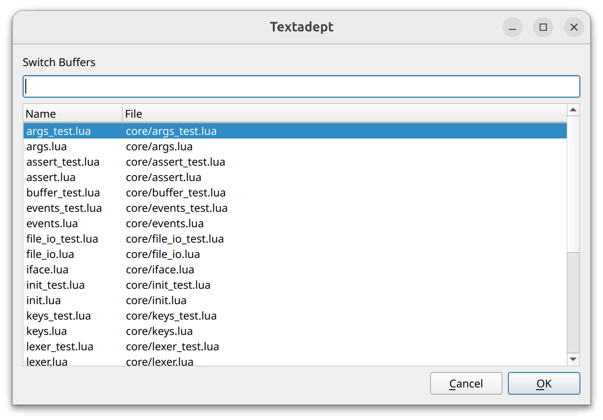</a>
<a href="assets/images/bufferbrowserfiltered.png">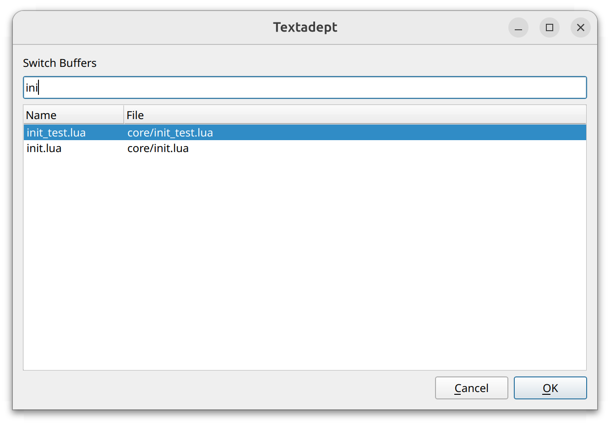</a>

The dialog shows more recently used buffers towards the top. You can change the dialog show
buffers in left-to-right tab order by setting [`ui.buffer_list_zorder`][]. For example, in
your *~/.textadept/init.lua*:

```lua
ui.buffer_list_zorder = false
```

[`ui.buffer_list_zorder`]: api.html#ui.buffer_list_zorder

### Editor View

<a href="assets/images/windows.png"></a>

The editor view is where you will spend most of your time in Textadept. You can split it
vertically and horizontally as many times as you like, and you can view the same buffer in two
or more separate views. Resize split views by clicking and dragging on the splitter bar that
separates them. Right-clicking inside a view brings up a context menu.

- Split a view horizontally into top and bottom views via `Ctrl+Alt+_` on Windows and Linux/BSD,
	`^⌘_` on macOS, and `M-_` in the terminal version.
- Split a view vertically into side-by-side views via `Ctrl+Alt+|` on Windows and Linux/BSD,
	`^⌘|` on macOS, and `M-|` in the terminal version.
- Cycle to the next split view via `Ctrl+Alt+PgDn` on Windows and Linux/BSD, `^⌘⇟`
	on macOS, and `M-^PgDn` in the terminal version.
- Cycle to the previous split view via `Ctrl+Alt+PgUp` on Windows and Linux/BSD, `^⌘⇞`
	on macOS, and `M-^PgUp` in the terminal version.
- Grow or shrink a view via `Ctrl+Alt++` or `Ctrl+Alt+-`, respectively, on Windows and Linux/BSD;
	`^⌘+` or `^⌘-`, respectively, on macOS; and `M-+` or `M--` in the terminal version.
- Unsplit the current view by removing its complement view(s) via `Ctrl+Alt+W` on Windows and
	Linux/BSD, `^⌘W` on macOS, and `M-W` in the terminal version.
- Unsplit the current view by removing all other views via `Ctrl+Alt+Shift+W` on Windows and
	Linux/BSD, `^⌘⇧W` on macOS, and `M-S-W` in the terminal version.

**Note:** depending on the split sequence, the order when cycling between views may not be linear.

### Find & Replace Pane

<a href="assets/images/findreplace.png">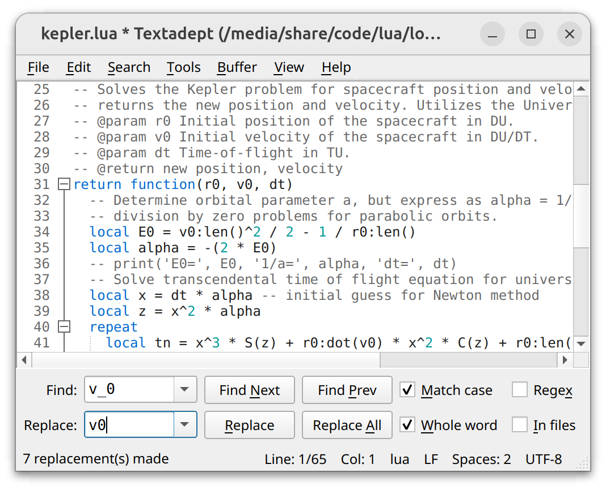</a>

The find & replace pane searches for text in files and directories. It has the usual
find and replace functionality you would expect, along with "Match Case", "Whole Word",
"[Regex](#regex-and-lua-pattern-syntax)", and "In Files" options. The pane also stores find
and replace history that you can cycle through.

**Note:** Textadept does not support multi-line searches (either regex or plain text).

**Terminal version note:** find and replace history is limited to 100 items each.

Summon the pane via `Ctrl+F` on Windows and Linux/BSD, `⌘F` on macOS, and `^F` in the terminal
version.

In the GUI version:

- Perform "Find Next" and "Find Prev" in the "Find" entry via `Enter` and `Shift+Enter`,
	respectively.
- Perform "Replace" and "Replace All" in the "Replace" entry via `Enter` and `Shift+Enter`,
	respectively.
- For at least the English locale on Windows and Linux/BSD, toggle the find options using their
	button mnemonics: `Alt+M`, `Alt+W`, `Alt+X`, `Alt+I`.
- Cycle through find/replace history via `Up` and `Down` on Windows, Linux, BSD, and the terminal
	version; and `⇡` and `⇣` on macOS.
- Dismiss the pane via `Esc`.

In the terminal version:

- Switch between "Find" and "Replace" entries via `Down` and `Up`.
- Toggle between "Find Next" and "Find Prev" in the "Find" entry via `Tab`.
- Toggle between "Replace" and "Replace All" in the "Replace" entry via `Tab`.
- Perform the highlighted find/replace action via `Enter`.
- Toggle the find options via `F1`, `F2`, `F3`, and `F4`.
- Cycle through find/replace history via `^P` and `^N`.
- Erase the contents of the focused entry via `^U`.
- Dismiss the pane via `Esc`.

When the "Regex" find option is enabled, the "Replace" entry interprets the following character
sequences:

- `\1` through `\9` represent their captured matching region's text, and `\0` represents all
	matched text.
- `\U` and `\L` converts everything up to the next `\L`, `\U`, or `\E` to uppercase and lowercase,
	respectively. (`\E` turns off conversion.)
- `\u` and `\l` converts the next character to uppercase and lowercase, respectively. These
	may appear within `\U` and `\L` constructs.

**Tip:** by default, "Replace All" replaces all text in the buffer. Selecting text and then
performing "Replace All" replaces all text in that selection only.

**Tip:** You can make Textadept automatically highlight all instances of found text in
the current buffer by setting [`ui.find.highlight_all_matches`][]. For example, in your
*~/.textadept/init.lua*:

```lua
ui.find.highlight_all_matches = true
```

[`ui.find.highlight_all_matches`]: api.html#ui.find.highlight_all_matches

#### Find in Files

Textadept can search for text within multiple files and directories via `Ctrl+Shift+F` on
Windows and Linux/BSD, `⌘⇧F` on macOS, and `M-^F` in the terminal version. Invoking "Find
Next" prompts you for a directory to search in. The "Replace" entry transforms into a "Filter"
entry that contains files and directories to include or exclude from the search.

A [filter][] consists of a comma-separated list of shell-style glob patterns that match filenames
and directories to include or exclude. The default filter excludes many common binary files
and version control directories from searches. It is included with any extra items you specify.

**Tip:** Textadept keeps track of filters set per-directory. You can also set per-directory filters
in Lua by modifying [`ui.find_in_files_filters`][]. For example, in your *~/.textadept/init.lua*:

```lua
-- Only search in certain source directories.
ui.find.find_in_files_filters['/path/to/project'] = {'include/**', 'src/**'}
```

Textadept shows search results in a temporary buffer. Jump to the next or previous result via
`Ctrl+Alt+G` or `Ctrl+Alt+Shift+G`, respectively, on Windows and Linux/BSD; `^⌘G` or `^⌘⇧G`,
respectively, on macOS; and `M-G` or `M-S-G`, respectively, in the terminal version. You can
also double-click on a result to jump to it, or use the arrow keys to navigate within the list
and press `Enter`.

<a href="assets/images/findinfiles.png">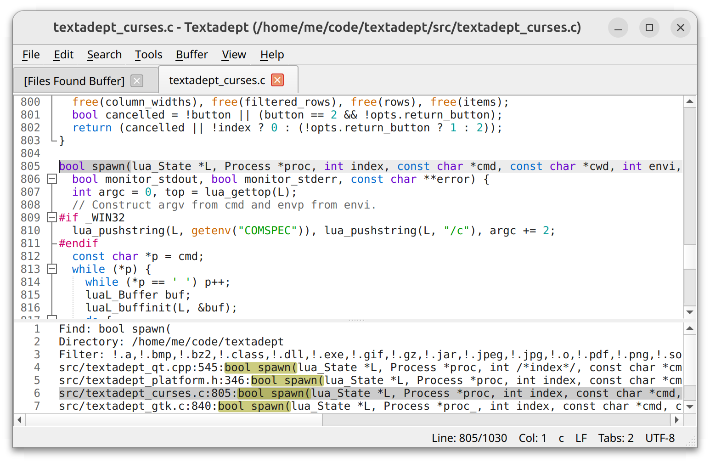</a>

[`ui.find_in_files_filters`]: api.html#ui.find.find_in_files_filters
[filter]: api.html#filters

#### Incremental Find

Textadept searches for text incrementally as you type when you summon the find & replace pane via
`Ctrl+Alt+F` on Windows and Linux/BSD, `^⌘F` on macOS, and `M-F` in the terminal version. The
"In Files" option does not apply in this mode.

### Command Entry

The command entry has many different roles:

- Execute Lua commands and change buffer, view, and module settings.
- Filter text through shell commands.
- Invoke shell commands to run code, build projects, or execute tests.
- [And more](api.html#ui.command_entry).

Each role has its own history that can be cycled through via the `Up` and `Down` key bindings
on Windows, Linux, BSD, and the terminal version; and `⇡` and `⇣` on macOS.

#### Lua Command Entry

<a href="assets/images/commandentry.png">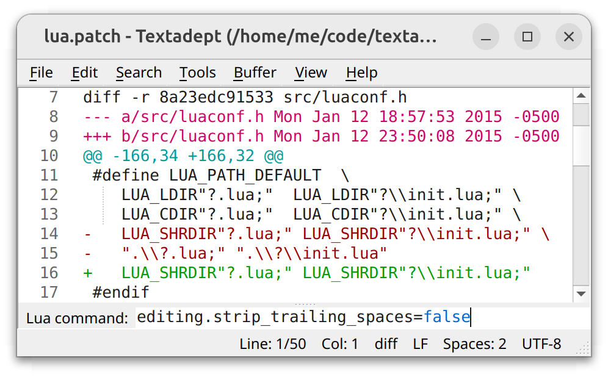</a>

Open the Lua command entry via `Ctrl+E` on Windows and Linux/BSD, `⌘E` on macOS, and `^E`
in the terminal version. Type in the Lua command or code to run and press `Enter` to execute
it. Textadept's [Lua API][] contains all of the application's built-in commands, settings, etc.

Show code completion candidates via `Tab` on Windows, Linux, BSD, and the terminal version;
and `⇥` on macOS. Use the arrow keys to make a selection and press `Enter` to insert it.

Lua code here runs in a modified environment for your convenience:

- The contents (keys) of the following tables are global variables:
	- [`buffer`](api.html#the-buffer-module)
	- [`view`](api.html#the-view-module)
	- [`ui`](api.html#ui)
	- [`textadept`](api.html#textadept)
- The first argument to `buffer` and `view` functions may be omitted.
- Commands with no arguments may omit the parentheses.

For example:

Lua code | Command entry equivalent
-|-
`buffer:reload()` | `reload`
`view:split(true)` | `split(true)`
`ui.tabs = false` | `tabs = false`
`textadept.keys['ctrl+n'] = buffer.new` | `keys['ctrl+n'] = new`

**Warning:** Textadept will not prevent you from wrecking its internal Lua state, so please
be careful.

**Tip:** Textadept's `-e` and `--execute` command line arguments run the given code as if
it was entered in the editor's Lua command entry. Since the GUI version of Textadept is a
single-instance application, you can send commands to that instance. For example:

```lua
textadept /path/to/file &
textadept -e "io.open_file('/path/to/another/file')"
```

[Lua API]: api.html

#### Shell Command Entry and Filtering Text

Filter text through shell commands via `Ctrl+|` on Windows and Linux/BSD, `⌘|` on macOS, and
`^\` or `^|` in the terminal version. For example, filtering a buffer's text through the Unix
`sort` command will sort that buffer's lines.

<a href="assets/images/presort.png">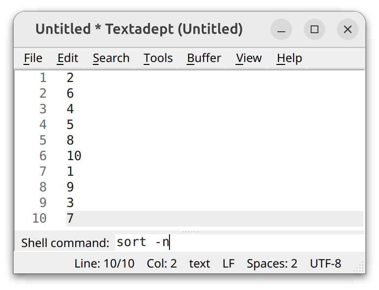</a>
<a href="assets/images/sorted.png">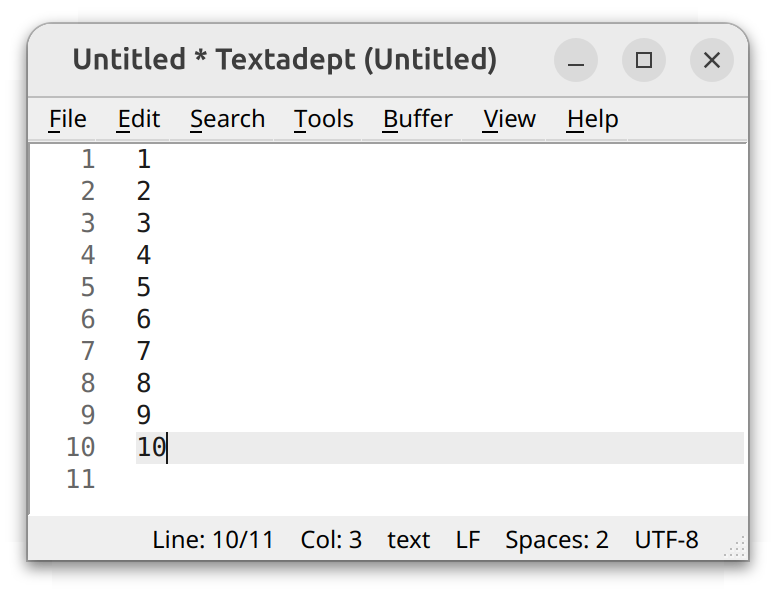</a>

Text passed as standard input to shell commands is determined as follows:

1. If no text is selected, the entire buffer's text is used.
2. If text is selected and either spans a single line, is a multiple selection, or is a
	rectangular selection, only that selected text is used.
3. If text is selected and spans multiple lines, all text on those lines is used. However,
	if the end of the selection is at the beginning of a line, that line is omitted.

The command's standard output replaces its input text.

**Warning:** commands that emit stdout while reading stdin (as opposed to emitting stdout only
after stdin is closed) may hang the GTK and terminal versions of Textadept if input generates
more output than stdout can buffer. For example, on Linux stdout may only be able to buffer
64K while there is still incoming input.

### Statusbar

The statusbar consists of two parts:

- Temporary status messages.
- Buffer status information.

Buffer status information includes:

- Current line and column number.
- Lexer language name for syntax highlighting and language-specific functionality.
- Line ending mode (EOL mode): either CRLF ("\r\n") or LF ('\n'). Line endings are the characters
	that separate lines.
- Indentation settings: an indentation mode (either tabs or spaces) and an indentation size
	(how many space characters are represented in a tab or in one level of indentation).
- Buffer encoding: how the buffer's text is saved to or read from the filesystem.

## Working with Files and Projects

Textadept provides many ways to open files:

- Open, using a standard file chooser dialog, one or more files in a single directory via
	`Ctrl+O` on Windows and Linux/BSD, `⌘O` on macOS, and `^O` in the terminal version.
- Open, using a quick open dialog, one or more files in the current project or Textadept's
	current working directory via `Ctrl+Shift+O` on Windows and Linux/BSD, `^⌘O` on macOS, and
	`M-^O` in the terminal version. Typing part of any filename filters the list, with spaces
	being wildcards. The arrow keys move the selection up and down. Holding down `Shift` while
	pressing the arrow keys selects multiple files, as does holding down `Ctrl` while clicking.
	Pressing `Enter` or selecting `OK` opens all selected files. Double-clicking on a single file
	opens it. (The terminal version requires pressing `Enter`.)
- Open, using a quick open dialog, one or more files in the directory of the currently opened
	file using the "Tools > Quick Open > Quickly Open Current Directory" menu item.
- Open a file by dragging it from a file manager and dropping it into one of Textadept's views.
- Open a recently opened file from a list of recent files via the "File > Open Recent..." menu
	item.
- Open, using a quick open dialog, one or more files in *~/.textadept/* via `Ctrl+Alt+U`
	on Windows and Linux/BSD, `⌘⇧U` on macOS, and `M-U` in the terminal version.
- Reopen the currently opened file, discarding any unsaved changes, using the "File > Reload"
	menu item. (Textadept prompts you do this if the editor detects it has been modified externally.)

**Windows Note:** Due to limitations in Lua and Microsoft's C runtime (MSVCRT), Textadept can
only open files whose *filenames* contain characters in the system's encoding, even if Windows
properly displays characters outside that encoding. For example, if the system's encoding is
CP1252 (English and most European languages), Textadept cannot open a filename that contains
Japanese characters in it. This limitation only exists for file *names*, not file *contents*.

### Projects

Textadept's only concept of a project is a parent directory under a recognized form of version
control (Git, Mercurial, SVN, Bazaar, and Fossil). There is no "Open Project" action. Textadept
can work with multiple projects at once, since the current project depends largely on context:

1. If the current buffer is a file, Textadept walks up its parent directory tree, looking for
	a version control directory. If one is found, its parent directory is the current project.
2. Textadept walks up its current working directory (cwd) tree, looking for a version control
	directory. If one is found, its parent directory is the current project.
3. If no version control directory is found, there is no current project.

**Tip:** you can specify Textadept's current working directory by passing it on the command
line when running the application. This effectively starts Textadept with a "default
project". You can also change the current working from within the editor by running the
`lfs.chdir('/path/to/folder')` command in the Lua command entry.

Textadept's quick open dialog for opening a file from the current project displays the first
5000 files it finds. You can increase this limit by changing [`io.quick_open_max`][]. You can
also filter out certain file types from showing in the list by adding a project-specific filter
to [`io.quick_open_filters`][]. For example, in your *~/.textadept/init.lua*:

```lua
io.quick_open_max = 10000 -- support huge projects
io.quick_open_filters['/path/to/project'] = {'include/**', 'src/**'} -- only show these directories
```

A [filter][] consists of a comma-separated list of shell-style glob patterns that match filenames
and directories to include or exclude. The default filter excludes many common binary files
and version control directories from searches. It is included with any extra items you specify.

<a href="assets/images/quickopen.png">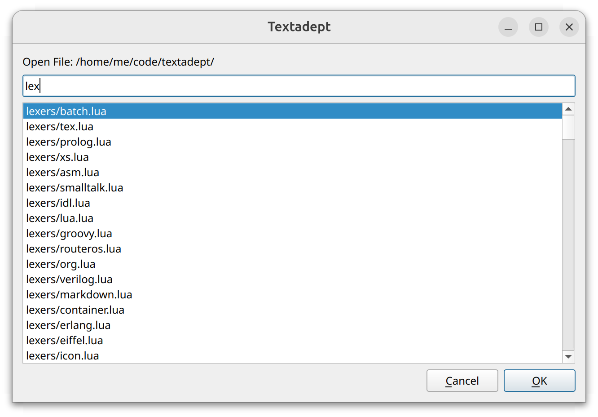</a>

You can mimic a more traditional approach to projects by saving and loading project-specific
sessions using the "File > Save Session..." and "File > Load Session..." menu items, respectively,
as well as using the `-s` and `--session` command line arguments. Textadept stores session
files in *~/.textadept/*, and the default session name is "session".

[`io.quick_open_filters`]: api.html#io.quick_open_filters
[`io.quick_open_max`]: api.html#io.quick_open_max
[filter]: api.html#filters

### Language

Textadept attempts to identify the programming language associated with files it opens and
assign a lexer for syntax highlighting:

1. The first line of the file is checked against the [Lua patterns](#regex-and-lua-pattern-syntax)
	in [`lexer.detect_patterns`][]. If there is a match, Textadept uses the lexer associated with
	that matching pattern.
2. The file's extension is checked against those in [`lexer.detect_extensions`][]. If there is
	a match, Textadept uses the lexer associated with that extension. If the file does not have
	an extension, Textadept uses the entire file name in the check.
3. Textadept falls back on a plain text lexer.

You can change or add lexers associated with first line patterns, file extensions, and file
names by modifying `lexer.detect_patterns` and `lexer.detect_extensions`. For example, in your
*~/.textadept/init.lua*:

```lua
lexer.detect_patterns['^#!.+/zsh'] = 'bash'
lexer.detect_extensions.luadoc = 'lua'
```

Textadept has lexers for more than 100 different programming languages, but if it is missing
a lexer for your language, you can [write one][], place it in your *~/.textadept/lexers/*
directory, and add an extension and/or pattern for it.

**Tip:** placing lexers in your user data directory avoids the possibility of you overwriting
them when you update Textadept.

You can manually change a buffer's lexer via `Ctrl+Shift+L` on Windows and Linux/ BSD, `⌘⇧L`
on macOS, and `M-^L` in the terminal version. Typing part of a lexer name in the dialog filters
the list, with spaces being wildcards. The arrow keys move the selection up and down. Pressing
`Enter`, selecting `OK`, or double-clicking on a lexer assigns it to the current buffer. (The
terminal version requires pressing `Enter`.)

[`lexer.detect_patterns`]: api.html#lexer.detect_patterns
[`lexer.detect_extensions`]: api.html#lexer.detect_extensions
[write one]: api.html#lexer

### End of Line Mode

Textadept attempts to detect a file's end-of-line mode (EOL mode), falling back on CRLF ("\r\n")
by default on Windows, and LF ('\n') on all other platforms. You can manually change this mode
using the "Buffer > EOL Mode" menu.

### Indentation

Textadept also attempts to identify a file's indentation settings, though the editor is more
likely to misidentify files with mixed indentation.

You can manually change a buffer's indentation by following these steps:

1. Toggle between using tabs and spaces via `Ctrl+Alt+T` on Windows and Linux/BSD, `^⌘T`
	on macOS, and `M-T` in the terminal version.
2. Set the indentation size using the "Buffer > Indentation" menu.
3. Optionally convert existing indentation to the new indentation settings using the "Buffer >
	Indentation > Convert Indentation" menu item.

The default indentation setting is a tab representing 8 spaces, but you can change this globally
and on a language-specific basis. For example, in your *~/.textadept/init.lua*:

```lua
-- Disallow auto-detection of indentation.
io.detect_indentation = false

-- Default indentation settings for all buffers.
buffer.use_tabs = false
buffer.tab_width = 2

-- Indentation settings for individual languages.
events.connect(events.LEXER_LOADED, function(name)
	if name == 'python' or name == 'yaml' then
		buffer.use_tabs = false
		buffer.tab_width = 4
	elseif name == 'go' then
		buffer.use_tabs = true
		buffer.tab_width = 4
	end
end)
```

### Encoding

Textadept attempts to detect a file's character encoding, either UTF-8, ASCII, CP1252, or
UTF-16. If you have files with other encodings, you can either:

- Add those encodings to the [`io.encodings`][] table before opening the file. For example,
	in your *~/.textadept/init.lua*:

	```lua
	io.encodings[#io.encodings + 1] = 'UTF-32'
	table.insert(io.encodings, 3, 'CP936') -- before CP1252

	-- Optionally add an item to the "Buffer > Encoding" menu.
	local menu = textadept.menu.menubar['Buffer/Encoding']
	local encoding = 'UTF-32'
	menu[#menu + 1] = {encoding, function() buffer:set_encoding(encoding) end}
	```

- Change the current file's encoding by running the [`buffer:set_encoding()`][] command in the
	[Lua Command Entry](#lua-command-entry). For example, if Textadept incorrectly detected a
	CP936 file as CP1252, run `set_encoding('CP936')` to switch the encoding to CP936.

The "Buffer > Encoding"	menu also allows you to change the current file's encoding.

[`io.encodings`]: api.html#io.encodings
[`buffer:set_encoding()`]: api.html#buffer.set_encoding

### View Settings

Textadept normally does not wrap long lines into view, nor does it show whitespace characters. You
can toggle line wrapping for the current buffer via `Ctrl+\` on Windows and Linux/BSD, `⌘\`
on macOS, and `M-\` in the terminal version. You can toggle whitespace visibility for the current
buffer using the "View > Toggle View Whitespace" menu item. The editor represents visible spaces
as dots and visible tabs as arrows.

On the left side of each editor view are margins that show line numbers, [bookmarks](#bookmarks),
and [fold markers](#code-folding). You can toggle the visibility of these margins using the
"View > Toggle Margins" menu item.

The GUI version of Textadept shows small guiding lines based on indentation level. You can toggle
the visibility of these guides for the current view using the "View > Toggle Show Indent Guides"
menu item.

The GUI version of Textadept also allows you to temporarily change the current view's font size:

- Increase the view's font size via `Ctrl+=` on Windows and Linux/BSD, and `⌘=` on macOS.
- Decrease the view's font size via `Ctrl+-` on Windows and Linux/BSD, and `⌘-` on macOS.
- Reset the view's font size to its normal value via `Ctrl+0` on Windows and Linux/BSD, and
	`⌘0` on macOS.

## Adept Editing

Textadept implements a commonly accepted set of text editor features and [key bindings][keys]
across each of its Platforms, including Bash-style key bindings on macOS and in the terminal
version. The editor also has its own advanced features, many of which are described in the
following sections.

[keys]: api.html#key-bindings

### Brace Matching, Auto-pair, and Typeover

Textadept highlights matching brace characters when the caret is over one of them: '(', ')', '[',
']', '{', or '}' for programming languages, and '<' or '>' for XML-like markup languages. Jump
to the current character's complement via `Ctrl+M` on Windows and Linux/BSD, `⌘M` on macOS,
and `M-M` in the terminal version.

The editor automatically inserts the complement of typed opening brace and quote characters,
deletes that complement if you type `Backspace`, and moves over the complement if you type it
(as opposed to inserting it again). You can configure or disable this behavior by modifying
[`textadept.editing.auto_pairs`][] and [`textadept.editing.typeover_auto_paired`][]. For example,
in your *~/.textadept/init.lua*:

```lua
-- Auto-pair and typeover '*' (Markdown emphasis/strong).
textadept.editing.auto_pairs['*'] = '*'

-- Disable only typeover.
textadept.editing.typeover_auto_paired = false

-- Disable auto-pair and typeover.
textadept.editing.auto_pairs = nil
```

[`textadept.editing.auto_pairs`]: api.html#textadept.editing.auto_pairs
[`textadept.editing.typeover_auto_paired`]: api.html#textadept.editing.typeover_auto_paired

### Word Highlight

Textadept can automatically highlight all occurrences of the word under the
caret, or all occurrences of the selected word (e.g. a variable name), by setting
[`textadept.editing.highlight_words`][]. For example, in your *~/.textadept/init.lua*:

```lua
-- Highlight all occurrences of the current word.
textadept.editing.highlight_words = textadept.editing.HIGHLIGHT_CURRENT
-- Highlight all occurrences of the selected word.
textadept.editing.highlight_words = textadept.editing.HIGHLIGHT_SELECTED
```

<a href="assets/images/wordhighlight.png">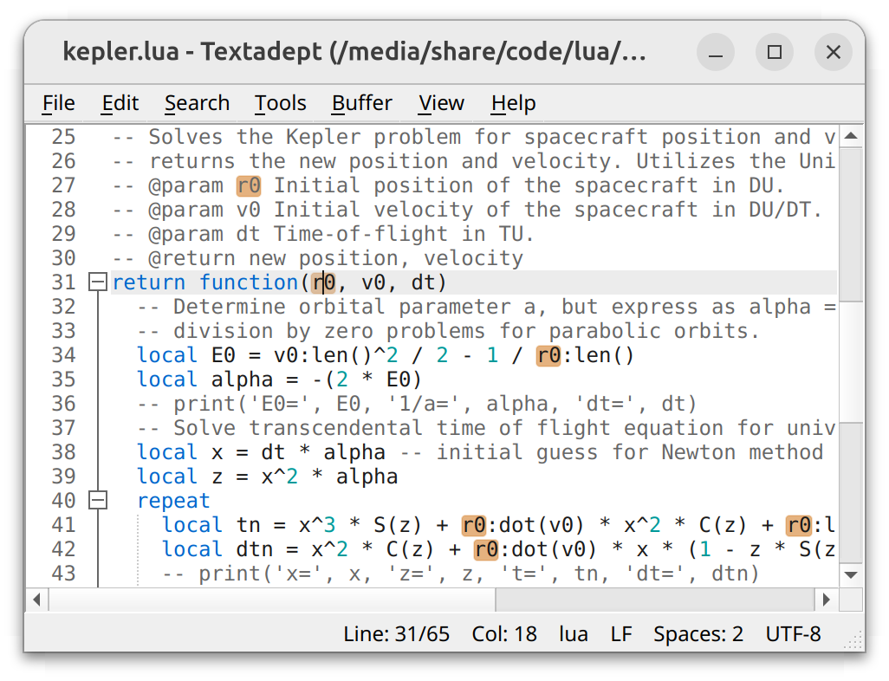</a>

Textadept does not perform any automatic highlighting by default.

[`textadept.editing.highlight_words`]: api.html#textadept.editing.highlight_words

### Autocompletion

Textadept autocompletes words in the current buffer via `Ctrl+Enter` on Windows and
Linux/BSD, `⌘↩` on macOS, and `^Enter` in the terminal version. If there are multiple
candidates, the editor shows a list of suggestions. Continuing to type may change the
suggestion. Use the arrow keys to navigate within the list and press `Enter` to finish
the completion. You can expand the word pool to include all open buffers by setting
[`textadept.editing.autocomplete_all_words`][]. For example, in *~/.textadept/init.lua*:

```lua
textadept.editing.autocomplete_all_words = true
```

**Tip:** the external [Language Server Protocol module][] provides language-specific
autocompletions. It also shows symbol documentation. These features enable you to easily
configure and extend Textadept, as well as understand its API, all from within the editor itself.

<a href="assets/images/lsp.png">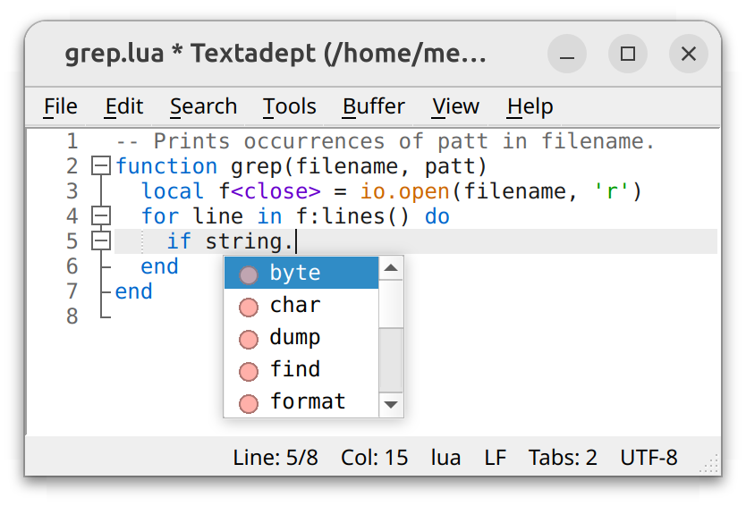</a>
<a href="assets/images/apidoc.png">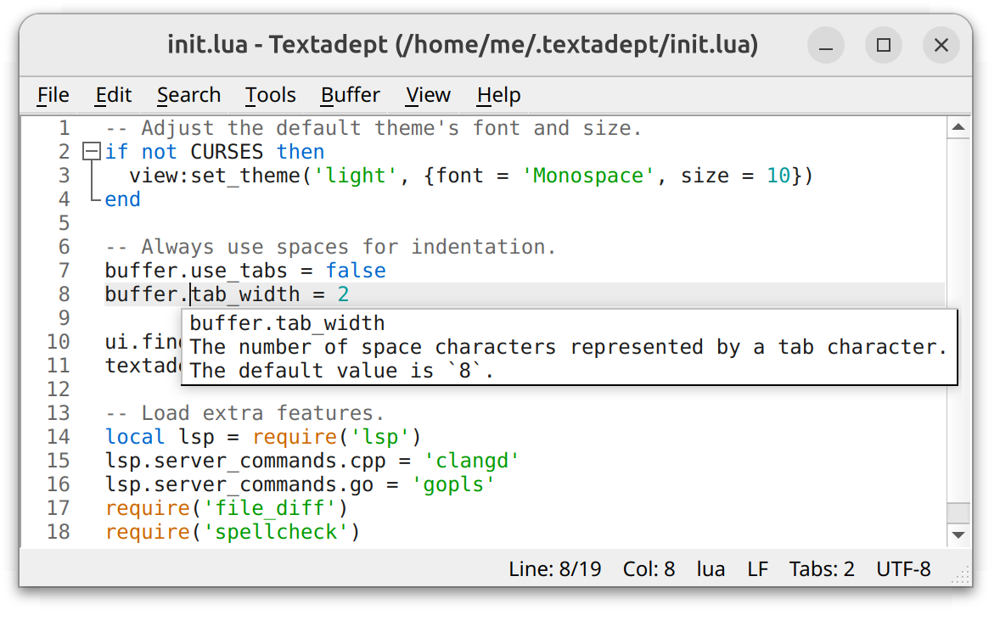</a>

[Language Server Protocol module]: https://github.com/orbitalquark/textadept-lsp
[`textadept.editing.autocomplete_all_words`]: api.html#textadept.editing.autocomplete_all_words

### Text Selections

Textadept has three kinds of text selections: contiguous, multiple, and rectangular.

You can create contiguous selections as follows:

- Make an arbitrary selection anchored at the caret by pressing the arrow keys, home/end, page
	up/down, etc. while holding down the `Shift` key, or by simply clicking and dragging the mouse.
- Make an arbitrary selection in the terminal version by entering selection mode via `^^` and
	using normal movement keys. This is for terminals that do not recognize `Shift` with movement
	keys. While in selection mode, swap the start and end positions via `^]` in order to alter
	the selection from its opposite side. Exit selection mode by typing text, deleting text,
	performing an action that changes text, or by pressing `^^` again.
- Select the current word via `Ctrl+D` on Windows and Linux/BSD, `⌘D` on macOS, and `^D` in the
	terminal version. Repeated use of this action selects subsequent occurrences of that word as
	additional (multiple) selections. Undo the most recent multiple selection via `Ctrl+Alt+D`,
	`^⌘D`, or `M-D`.
- Select the current line via `Ctrl+L` on Windows and Linux/BSD, `⌘L` on macOS, and `^L` in the
	terminal version. If text is already selected and spans multiple lines, this action expands
	the selection to include whole lines.
- Double click to select a word, and triple-click to select a line.
- Click and optionally drag within the line number margin to select whole lines.
- Select the current paragraph via `Ctrl+Shift+P` on Windows and Linux/BSD, `⌘⇧P` on macOS,
	and `M-^P` in the terminal version. Paragraphs are surrounded by one or more blank lines.
- Select all buffer text via `Ctrl+A` on Windows and Linux/BSD, `⌘A` on macOS, and `^A` in the
	terminal version.
- Select text between matching delimiters (parentheses, brackets, braces, single quotes,
	double-quotes, back quotes, and HTML/XML tag characters) via `Ctrl+Shift+M` on Windows and
	Linux/BSD, `⌘⇧M` on macOS, and `M-^M` in the terminal version. Repeated use of this action
	toggles the selection of the delimiters themselves.
- Undo a selection via `Ctrl+Shift+A` on Windows and Linux/BSD, `⌘⇧A` on macOS, and `M-^A` in
	the terminal version. (This is useful in case you accidentally press `Ctrl+A`, `⌘A`, or `^A`.)
- When using the mouse in the terminal version in the Windows command prompt, Shift+Double-click
	extends the selection to the clicked point, and quadruple-click within a selection collapses it.

You can create multiple selections as follows:

- Add another selection by holding down `Ctrl`, clicking, and optionally dragging the mouse
	over a range of text.
- Select as an additional selection the next occurrence of the current word via `Ctrl+D`
	on Windows and Linux/BSD, `⌘D` on macOS, and `^D` in the terminal version.

Textadept mirrors any typed or pasted text at each selection. Deselect a particular additional
selection by holding down `Ctrl` and clicking it with the mouse.

<a href="assets/images/prerename.png">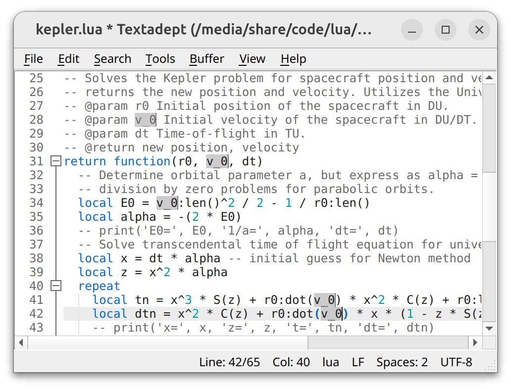</a>
<a href="assets/images/renamed.png">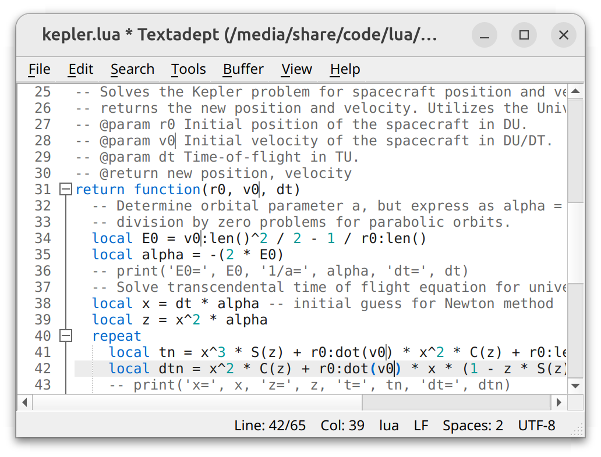</a>

You can create a rectangular selection as follows:

- Press the arrow keys, home/end, or page up/down, while holding down `Alt+Shift` on Windows
	and Linux/BSD, `^⇧` on macOS, and `M-S-` in the terminal version.
- Click and drag the mouse while holding down the `Alt` key on Windows and Linux/BSD, and `⌥`
	on macOS.
- Click and drag the mouse without holding down any modifiers (thus making a normal, multi-line
	selection), press and hold down the `Alt` key on Windows and Linux/BSD, `⌥` on macOS, and
	`M-` in the terminal version, and then continue dragging the mouse. This works around the
	Linux/BSD window managers that consume `Alt+Shift` + arrow keys and `Alt` + mouse drag.

Textadept allows a zero-width rectangular selection that spans multiple lines, and mirrors any
typed or pasted text on all of those lines.

<a href="assets/images/rectangularselection.png">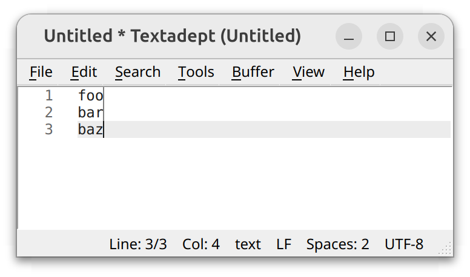</a>
<a href="assets/images/rectangularselection2.png">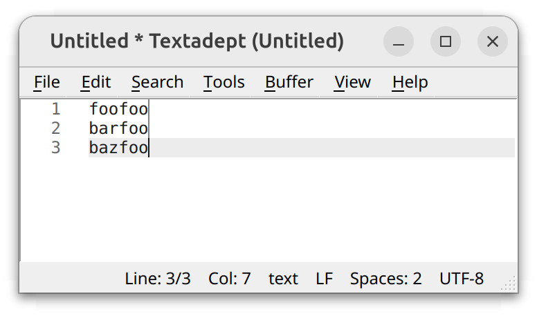</a>

You can also copy rectangular blocks of text and paste them into rectangular blocks of the
same size.

**Note:** macOS does not support directly pasting into rectangular selections. Instead, use
the [Lua Command Entry](#lua-command-entry) and enter `replace_rectangular(clipboard_text)`
after copying a block of text.

### Text Transformations

Textadept can apply many different transformations to the current word, line, and selected text:

- Enclose the current word or selected text within delimiters like parentheses, braces, brackets,
	single quotes, double quotes, or HTML/XML tags using the key bindings listed in the "Edit >
	Selection" submenu.
- Convert the selected text or current word to upper or lower case via `Ctrl+Shift+U` or
	`Ctrl+U`, respectively, on Windows and Linux/BSD; `⌘U` or `⌘⇧U`, respectively, on macOS;
	and `M-^U` or `M-U` in the terminal version.
- Increase or decrease the indentation of the selected lines via `Tab` or `Shift+Tab`,
	respectively, on Windows and Linux/BSD; `⇥` or `⇧⇥`, respectively on macOS; and `Tab` or
	`S-Tab` in the terminal version. You do not have to select whole lines; selecting any part
	of a line is sufficient.
- Move the current or selected line(s) up or down via `Ctrl+Alt+Shift+Up` or
	`Ctrl+Alt+Shift+Down`, respectively, on Windows and Linux/BSD; and `^⌘⇧⇡` or `^⌘⇧⇣`,
	respectively, on macOS. You do not have to select whole lines; selecting any part of a line
	is sufficient.
- Comment out code on the current or selected line(s) via `Ctrl+/` on Windows and Linux/BSD, `⌘/`
	on macOS, and `^?` or `M-/` in the terminal version. You do not have to select whole lines;
	selecting any part of a line is sufficient.
- Enclose selected text between any typed punctuation character (taking into account
	[`textadept.editing.auto_pairs`][]) after setting [`textadept.editing.auto_enclose`][]. For
	example, in your *~/.textadept/init.lua*:

	```lua
	textadept.editing.auto_enclose = true
	```

[`textadept.editing.auto_pairs`]: api.html#textadept.editing.auto_pairs
[`textadept.editing.auto_enclose`]: api.html#textadept.editing.auto_enclose

### Navigate Through History

Textadept records buffer positions within views over time and allows for navigating through
that history. Navigate backward or forward via `Ctrl+[` or `Ctrl+]`, respectively, on Windows
and Linux/BSD; `⌘[` or `⌘]`, respectively, on macOS; and `M-[` or `M-]`, respectively, in the
terminal version.

### Go To Line

Jump to a specific line in the current buffer via `Ctrl+G` on Windows and Linux/BSD, `⌘G`
on macOS, and `^G` in the terminal version. Enter the line number to go to in the prompt,
and press `Enter` or click `OK`.

### Bookmarks

Textadept allows you to bookmark lines and jump back to them later:

- Toggle a bookmark on the current line via `Ctrl+K` on Windows and Linux/BSD, `⌘K` on macOS,
	and `^K` in the terminal version.
- Go to the next bookmarked line via `Ctrl+Alt+K` on Windows and Linux/BSD, `^⌘K` on macOS, and
	`M-K` in the terminal version.
- Go to the previously bookmarked line via `Ctrl+Alt+Shift+K` on Windows and Linux/BSD, `^⌘⇧K`
	on macOS, and `M-S-K` in the terminal version.
- Go to the bookmarked line selected from a list via `Ctrl+Shift+K` on Windows and Linux/BSD,
	`⌘⇧K` on macOS, and `M-^K` in the terminal version.
- Clear all bookmarks in the current buffer using the "Tools > Bookmarks > Clear Bookmarks"
	menu item.

The editor displays bookmarks in the left-hand margin after line numbers.

### Macros

Macros enable you to record a series of edits and play them back without having to write a
custom Lua script:

- Start and stop recording a macro via `Alt+,` on Windows and Linux/BSD, `^,` on macOS, and `M-,`
	in the terminal version. The status bar displays when a macro starts and stops recording.
- Play back the most recently recorded or loaded macro via `Alt+.` on Windows and Linux/BSD,
	`^.` on macOS, and `M-.` in the terminal version.
- Register the most recently recorded macro to alphanumeric character *char* via
	`Ctrl+Alt+Shift+R` *char* on Windows and Linux/BSD, `^⌘⇧R` *char* on macOS, and `M-S-R` *char*
	in the terminal version. Note that this is a two-sequence [key chain](#key-bindings).
- Optionally save the most recently recorded macro to a file using the "Tools > Macros >
	Save..." menu item.
- Load and play a macro registered to alphanumeric character *char* via `Ctrl+Alt+R` *char* on
	Windows and Linux/BSD, `^⌘R` *char* on macOS, and `M-R` *char* in the terminal version. Note
	that this is a two-sequence [key chain](#key-bindings). You can now replay this loaded macro
	via the default macro play key binding.
- Load a saved macro from a file using the "Tools > Macros > Load..." menu item. Play the
	loaded macro via the default macro play key binding.

**Tip:** the previously recorded/loaded macro is always registered to `0` (zero), so if you
accidentally recorded/loaded a macro without having registered/saved the previous one, you can
reload and play it via `Ctrl+Alt+R 0` on Windows and Linux/BSD, `^⌘R 0` on macOS, and `M-R 0`
in the terminal version.

### Snippets

Snippets are dynamic text templates for quickly inserting code constructs. They may contain
plain text, placeholders for interactive input, mirrors and transforms for interactive input,
and arbitrary Shell code.

<a href="assets/images/snippet.png">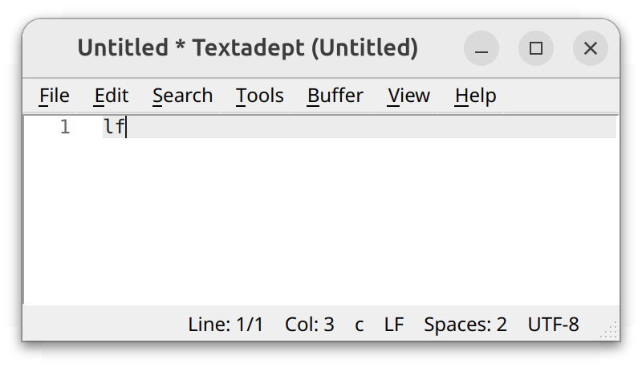</a>
<a href="assets/images/snippet2.png">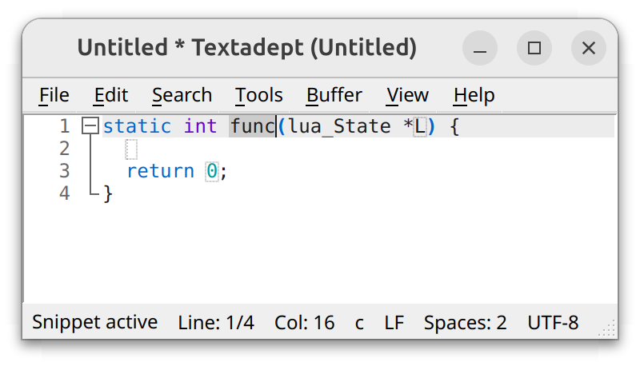</a>

A snippet has a trigger word associated with template text in the [`snippets`][] table. The
[snippets documentation][] describes snippet syntax. Language-specific snippets are in a subtable
assigned to their language's lexer name. Snippets may also be the contents of files in a snippet
directory, with file names being trigger words.

- Insert a snippet from a list of available snippets using the "Tools > Snippets > Insert
	Snippet..." menu item. Typing part of a snippet trigger in the dialog filters the list, with
	spaces being wildcards. The arrow keys move the selection up and down. Pressing `Enter`,
	selecting `OK`, or double-clicking on a snippet inserts it into the current buffer. (The
	terminal version requires pressing `Enter`.)
- Autocomplete a snippet trigger word using the "Tools > Snippets > Complete Trigger Word" menu
	item. If there are multiple candidates, the editor shows a list of suggestions. Continuing
	to type may change the suggestion. Use the arrow keys to navigate within the list and press
	`Enter` to finish the completion.
- Insert a snippet based on the trigger word behind the caret via `Tab` on Windows, Linux,
	BSD, and in the terminal version; and `⇥` on macOS. You can insert another snippet within
	an active snippet. A previously active snippet will pick up where it left off after a nested
	snippet finishes.
- Navigate to the next placeholder in the current snippet via `Tab` on Windows, Linux, BSD,
	and in the terminal version; and `⇥` on macOS.
- Navigate to the previous placeholder in the current snippet via `Shift+Tab` on Windows and
	Linux/BSD, `⇧⇥` on macOS, and `S-Tab` in the terminal version. If there is no previous
	placeholder, this action cancels the current snippet.
- Cancel the current snippet via `Esc`.

[`snippets`]: api.html#_G.snippets
[snippets documentation]: api.html#textadept.snippets

### Code Folding

Many of Textadept's lexers can identify blocks of code and mark their fold points in the editor's
left-hand margin.

- Toggle the visibility of a code block by clicking on its marker, or toggle the visibility
	of the current block via `Ctrl+}` on Windows and Linux/BSD, `⌘}` on macOS, and `M-}` in the
	terminal version.
- Use the "View > Code Folding" submenu to manipulate folds.
- Turn off/on code folding for a buffer using the "Buffer > Toggle Code Folding" menu item.

**Tip:** you can turn off code folding completely by changing `buffer.folding`. For example
in your *~/.textadept/init.lua*:

```lua
buffer.folding = false
```

<a href="assets/images/folding.png">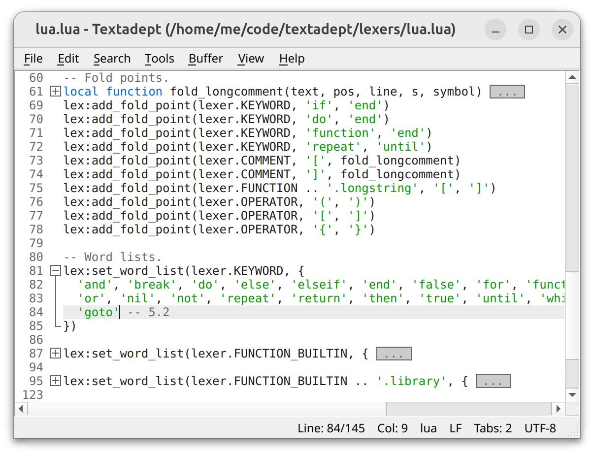</a>

### Virtual Space

Textadept normally constrains the caret within the content of text lines. Enabling virtual
space allows you to move the caret into the space beyond the ends of lines. Toggle virtual
space using the "View > Toggle Virtual Space" menu item.

### Key Bindings

Key bindings are key sequences assigned to commands (Lua functions) in the [`keys`][] table. A
key sequence is an ordered combination of modifier keys followed by either the key's inserted
character or, if no such character exists, the string representation of the key according to
[`keys.KEYSYMS`][]. Language-specific keys are in a subtable assigned to their language's lexer
name. You can assign key sequences to tables of key bindings to create key chains (e.g. Emacs
`C-x` prefix). You can also group key bindings into modes such that while a mode is active,
Textadept ignores all key bindings outside that mode until the mode is unset (e.g. Vim-style
modal editing). The [keys documentation][] describes all of this in more detail.

**Tip**: you can query a key binding's sequence and see if it has an assigned command via
`Ctrl+Shift+H` on Windows and Linux/BSD, `⌘⇧H` on macOS, and `M-S-H` in the terminal
version. While this mode is active, the statusbar shows typed key sequences and their assigned
commands, if any. Textadept also copies the sequence to the clipboard. Pressing `Esc` deactivates
the mode.

[`keys`]: api.html#keys
[`keys.KEYSYMS`]: api.html#keys.KEYSYMS
[keys documentation]: api.html#the-keys-module

## Compile, Run, Build, and Test

Textadept knows most of the commands that compile and/or run code in source files. It also
knows some of the commands that build projects, and you can tell the editor how to run your
project's test suite. Finally, Textadept allows you to run arbitrary commands in the context
of your project. The editor prints command output in real-time to a temporary buffer and marks
any warning and error messages it recognizes.

- Compile the current file via `Ctrl+Shift+C` on Windows and Linux/BSD, `⌘⇧C` on macOS, and
	`M-^C` in the terminal version.
- Run the current file via `Ctrl+R` on Windows and Linux/BSD, `⌘R` on macOS, and `^R` in the
	terminal version.
- Build the current project via `Ctrl+Shift+B` on Windows and Linux/BSD, `⌘⇧B` on macOS, and
	`M-^B` in the terminal version.
- Run tests for the current project via `Ctrl+Shift+T` on Windows and Linux/BSD, `⌘⇧T`
	on macOS, and `M-^T` in the terminal version.
- Run a command for the current project via `Ctrl+Shift+R` on Windows and Linux/BSD, `⌘⇧R`
	on macOS, and `M-^R` in the terminal version.
- Stop the currently running compile, run, build, or test command's process via `Ctrl+Shift+X`
	on Windows and Linux/BSD, `⌘⇧X` on macOS, and `M-^X` in the terminal version.
- Jump to the source of the next recognized warning or error via `Ctrl+Alt+E` on Windows and
	Linux/BSD, `^⌘E` on macOS, and `M-E` in the terminal version.
- Jump to the source of the previously recognized warning or error via `Ctrl+Alt+Shift+E`
	on Windows and Linux/BSD, `^⌘⇧E` on macOS, and `M-S-E` in the terminal version.
- Jump to the source of the recognized warning or error on the current line via `Enter`,
	or by double-clicking on that line.

Prior to running a compile, run, build, or test command, Textadept prompts you with either:

1. A command it thinks is appropriate for the current file or project.
2. A command you have specified for the current context (e.g. via *~/.textadept/init.lua*).
3. A command you have previously run in the current context.
4. A blank command for you to fill in.

Make any necessary changes to the command and then run it by pressing `Enter`. Cycle through
command history via `Up` and `Down` on Windows, Linux, BSD, and the terminal version; and `⇡`
and `⇣` on macOS. Cancel the prompt via `Esc`. Textadept remembers compile and run commands on
a per-filename basis, and it remembers build, test, and project commands on a per-directory basis.

<a href="assets/images/runerror.png">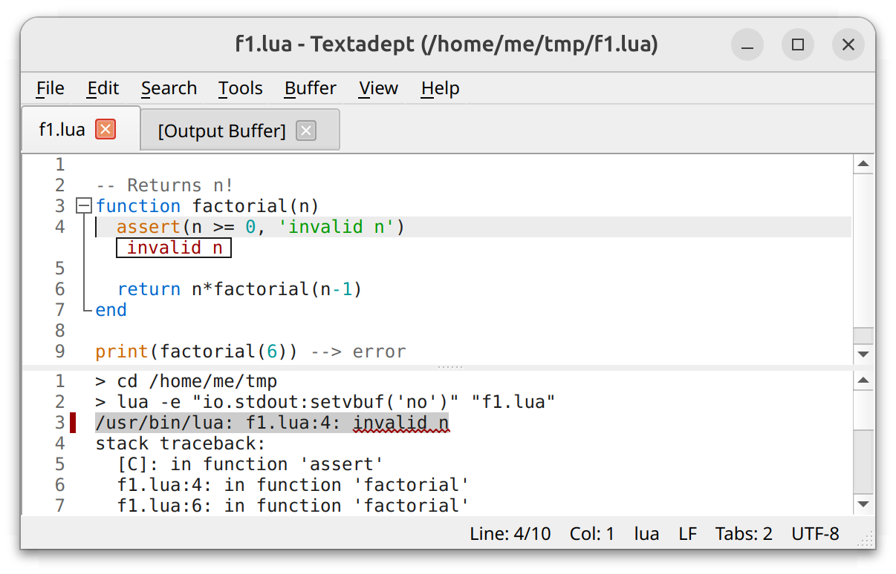</a>

You can configure Textadept to run commands immediately without a prompt by setting
[`textadept.run.run_without_prompt`][]. You can also have the editor print command output in
the background by changing [`textadept.run.run_in_background`][]. For example, in your *~/.textadept/init.lua*:

```lua
textadept.run.run_without_prompt = true
textadept.run.run_in_background = true
```

You can change or add compile, run, build, test, and project commands by modifying
the [`textadept.run.compile_commands`][], [`textadept.run.run_commands`][],
[`textadept.run.build_commands`][], [`textadept.run.test_commands`][], and
[`textadept.run.run_project_commands`][] tables, respectively. For example, in your
*~/.textadept/init.lua*:

```lua
textadept.run.compile_commands.foo = 'foo "%f"'
textadept.run.run_commands.foo = './"%e"'

textadept.run.build_commands['/path/to/project'] = 'make -C src -j4'
textadept.run.test_commands['/path/to/project'] = 'lua tests.lua'
textadept.run.run_project_commands['/path/to/project'] = function() ... end
```

**Tip:** you can set compile and run commands on a per-filename basis.

**macOS Tip:** GUI applications like *Textadept.app* run in a restricted environment with a
stripped-down `$PATH`. (The terminal version is unaffected.) Thus, Textadept may fail to find
compile/run programs outside that `$PATH` (e.g. programs installed with Homebrew). The editor
attempts to work around this by silently invoking your `$SHELL` and extracting its environment
(including its full `$PATH`), but if this fails, you will need to supply absolute paths to
executables.

[`textadept.run.run_without_prompt`]: api.html#textadept.run.run_without_prompt
[`textadept.run.run_in_background`]: api.html#textadept.run.run_in_background
[`textadept.run.compile_commands`]: api.html#textadept.run.compile_commands
[`textadept.run.run_commands`]: api.html#textadept.run.run_commands
[`textadept.run.build_commands`]: api.html#textadept.run.build_commands
[`textadept.run.test_commands`]: api.html#textadept.run.test_commands
[`textadept.run.run_project_commands`]: api.html#textadept.run.run_project_commands

## Modules

Modules are packages of Lua code that provide functionality for Textadept. Most of the editor's
features come from individual modules (Textadept's *core/* and *modules/* directories). Textadept
can load modules when the application starts up, and it can load modules on-demand in response
to events. Once a module is loaded, it persists in memory and is never unloaded.

Textadept attempts to load a given module from the following locations:

1. Your *~/.textadept/modules/* directory.
2. Textadept's *modules/* directory.

**Tip:** placing modules in your user data directory avoids the possibility of you overwriting
them when you update Textadept.

Just because a module exists does not mean Textadept will automatically load it. The editor
only loads modules it is explicitly told to load (e.g. from your *~/.textadept/init.lua*). For
example, in your *~/.textadept/init.lua*:

```lua
local lsp = require('lsp')
lsp.server_commands.cpp = 'clangd'
```

If you have a module for a particular programming language, you can automatically load it when
opening a file of that type:

```lua
events.connect(events.LEXER_LOADED, function(name)
	if package.searchpath(name, package.path) then require(name) end
end)
```

**Note:** lexer language names are typically the names of lexer files in your
*~/.textadept/lexers/* directory and Textadept's *lexers/* directory.

### Developing Modules

Modules follow the Lua package model: a module is either a single Lua file or a group of Lua files
in a directory that contains an *init.lua* file (which is the module's entry point). The name
of the module is its file name or directory name, respectively. Here are some basic guidelines
for developing modules, and some things to keep in mind:

- Modules should return a table of functions and fields that are defined locally, rather than
	globally. (This is standard Lua practice.) That way, the construct `local foo = require('foo')`
	behaves as expected.
- Modules should not define global variables, as all modules share the same Lua state.
- Modules should only be named after lexer languages if they provide language-specific
	functionality.
- Modules must not call any functions that create buffers and views (e.g. `ui.print()`,
	`io.open_file()`, and `buffer.new()`) at file-level scope. Buffers and views can only be
	created within functions assigned to keys, associated with menu items, or connected to events.

## Themes

Themes customize the editor's look and feel. Textadept comes with three built-in themes: "light",
"dark", and "term". The default theme for the GUI version is "light" if light mode is currently
enabled, or "dark" if dark mode is enabled. The default theme for the terminal version is "term".

<a href="assets/images/windows.png"></a>
<a href="assets/images/macos.png"></a>

A theme consists of a single Lua file, and defines the [colors][] and [text display settings][]
(styles) used in syntax highlighting. It also assigns colors to various UI elements like carets,
selections, margins, markers, highlights, errors, and warnings.

**Note:** Textadept cannot theme its own GUI widgets. You must use the theming tools provided
by the applicable Qt or GTK widget toolkit.

[colors]: api.html#view.colors
[text display settings]: api.html#view.styles

Textadept attempts to load themes from the following locations:

1. Your *~/.textadept/themes/* directory.
2. Textadept's *themes/* directory.

**Tip:** placing themes in your user data directory avoids the possibility of you overwriting
them when you update Textadept.

You can set Textadept's theme using [`view:set_theme()`][]. You can also tweak a theme's styles
on a per-language basis. For example, in your *~/.textadept/init.lua*:

```lua
if not CURSES then
	view:set_theme('light', {font = 'Monospace', size = 12})
	-- You can alternatively use the following to keep the default theme:
	-- view:set_theme{font = 'Monospace', size = 12}
end

-- Color Java class names black instead of the default yellow.
events.connect(events.LEXER_LOADED, function(name)
	if name ~= 'java' then return end
	local default_fore = view.style_fore[view.STYLE_DEFAULT]
	view.style_fore[buffer:style_of_name(lexer.CLASS)] = default_fore
end)
```

**Tip:** you can experiment with themes without having to restart Textadept by using the
[`reset()`][] command in the [Lua Command Entry](#lua-command-entry). After making changes
to either your *~/.textadept/init.lua* or theme file, issue the `reset` command to reload
your changes.

[`view:set_theme()`]: api.html#view.set_theme
[`reset()`]: api.html#reset

## Scripting

Nearly every aspect of Textadept can be scripted, extended, and customized with Lua. In fact, most
of the editor's features are implemented in Lua: syntax highlighting, opening and saving files,
and search and replace, to name a few. Textadept contains its own internal copy of [Lua 5.4][].

Being an event-driven application, Textadept simply responds to input like key presses,
mouse clicks, and state changes by running Lua code (more specifically, executing Lua
functions). For example, when you press a key, Textadept emits an `events.KEYPRESS` event,
which its *core/keys.lua* is listening for. When the editor recognizes a key sequence like
`Ctrl+O` on Windows and Linux/BSD, *core/keys.lua* looks up which Lua function is assigned
to the `keys['ctrl+o']` key. By default, it is `io.open_file()`, so Textadept executes that
function, which prompts the user for a file to open. You could bind a different function to
that key and the editor will duly execute it instead. Similarly, when Textadept opens a file via
`io.open_file()`, that function emits a `events.FILE_OPENED` event, which you could listen for in
your *~/.textadept/init.lua* and perform your own action, such as loading some project-specific
tools for editing that file.

Your *~/.textadept/init.lua* is the entry point to scripting Textadept. In this file you can set
up custom key bindings, menu items, and event handlers that will perform custom actions. Here
are some ideas:

- Define custom [key bindings][] and [menu items][] that manipulate [`buffer`][] contents.
- Extend Textadept's File menu with a menu item that prompts for a commit message using an
	[interactive dialog][], and then invokes a [project command][] that commits the current file
	to version control using the provided message.
- Listen for the `events.FILE_SAVED` [event][] and [spawn][] an asynchronous process that runs
	a syntax checker, linter, or formatter on a source file when it is saved.
- Start searches with the word under the caret by substituting the "Search > Find" menu item
	and key binding functions with a custom function that pre-populates `ui.find.find_entry_text`
	before calling `ui.find.focus()` to show the [find & replace pane][].
- Auto-save files as you switch between buffers by listening for the `events.BUFFER_BEFORE_SWITCH`
	event and calling `buffer:save()` for buffers that have a `buffer.filename`. You can even
	auto-save on a timer via [`timeout()`][].
- Overload Textadept's find & replace capabilities to use Lua patterns instead of regex by
	reacting to `events.FIND` and `events.REPLACE` before Textadept can, and then determining
	whether or not the editor's default routines should handle those events.
- Register your own command line argument using [`args.register()`][] to add a "read-only" mode.
- Add a custom command to the default right-click context menu by appending to
	[`textadept.menu.context_menu`][].

Textadept's [Lua API][] is extensively documented and serves as the ultimate resource when it
comes to scripting the editor.

[Lua 5.4]: https://www.lua.org/manual/5.4
[key bindings]: api.html#keys
[menu items]: api.html#textadept.menu.menubar
[`buffer`]: api.html#buffer
[interactive dialog]: api.html#ui.dialogs
[project command]: api.html#textadept.run.run_project
[event]: api.html#events
[spawn]: api.html#os.spawn
[find & replace pane]: api.html#ui.find
[`timeout()`]: api.html#timeout
[`args.register()`]: api.html#args.register
[`textadept.menu.context_menu`]: api.html#textadept.menu.context_menu
[Lua API]: api.html

## Compiling

Textadept uses [CMake][] to build on Windows, macOS, Linux, and BSD. CMake automatically detects
which UI toolkits are available and builds for them. On Windows and macOS you can then use CMake
to create a self-contained application to run from anywhere. On Linux and BSD you can either
use CMake to install Textadept, or place compiled binaries into Textadept's root directory and
run it from there.

### Requirements

Textadept requires the following:

- [CMake][] 3.22+
- A C and C++ compiler, such as:
	- [GNU C compiler][] (*gcc*) 7.1+
	- [Microsoft Visual Studio][] 2019+
	- [Clang][] 13+
- A UI toolkit (at least one of the following):
	- [Qt][] 5.15+ development libraries for the GUI version
	- [GTK][] 2.24+ development libraries for the GUI version
	- [ncurses][](w) development libraries (wide character support) for the terminal version

**macOS Note:** [XCode][] provides Clang.

**Linux Note:** a package manager likely supplies these requirements. On Ubuntu for example,
the `build-essential`, `qtbase5-dev`, `libgtk-3-dev` (or `libgtk2.0-dev`), and `libncurses-dev`
packages are all that is needed.

[CMake]: https://cmake.org
[GNU C compiler]: https://gcc.gnu.org
[Microsoft Visual Studio]: https://visualstudio.microsoft.com/
[Clang]: https://clang.llvm.org
[Qt]: https://www.qt.io
[GTK]: https://www.gtk.org/download/linux.php
[ncurses]: https://invisible-island.net/ncurses/#download_ncurses
[XCode]: https://developer.apple.com/xcode/

### Compiling

Basic procedure:

1. Configure CMake by pointing it to Textadept's source directory (where *CMakeLists.txt* is),
	specify a directory to build in, and optionally specify a directory to install to. CMake will
	determine what UI toolkits are available and fetch third-party build dependencies.
	<br/><a href="assets/images/compile.png">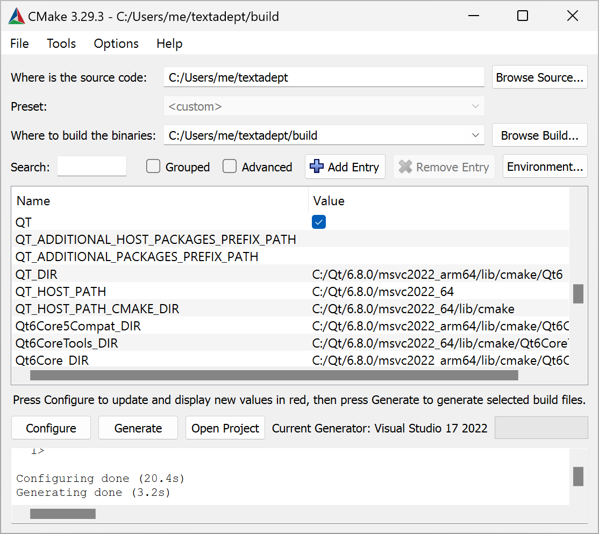</a>
2. Build Textadept.
3. Either copy the built binaries to Textadept's source directory or use CMake to install it.

For example:

```bash
cmake -S . -B build_dir -D CMAKE_BUILD_TYPE=RelWithDebInfo \
	-D CMAKE_INSTALL_PREFIX=build_dir/install
cmake --build build_dir -j # compiled binaries are in build_dir/
cmake --install build_dir # self-contained installation is in build_dir/install/
```

**Windows Note:** you need to run these commands from Visual Studio's developer command prompt
if you are not using CMake's GUI and Visual Studio.

**Tip:** you can use the environment variable `TEXTADEPT_HOME` to specify the location of
Textadept's root directory. Doing so allows you to run Textadept executables directly from the
binary directory without having to install or copy them.

**Windows and macOS Note:** when creating the self-contained Qt version of Textadept, Qt's
*bin/* directory should be in your `%PATH%` or `$PATH`, respectively.

CMake boolean variables that affect the build:

- `NIGHTLY`: Whether or not to build Textadept with bleeding-edge dependencies (i.e. the nightly
	version). Defaults to off.
- `QT`: Unless off, builds the Qt version of Textadept. The default is auto-detected.
- `GTK3`: Unless off, builds the Gtk 3 version of Textadept. The default is auto-detected.
- `GTK2`: Unless off, builds the Gtk 2 version of Textadept. The default is auto-detected.
- `CURSES`: Unless off, builds the Curses (terminal) version of Textadept. The default is
	auto-detected.
- `GENERATE_HTML`: When on, creates a `html` target to build HTML documentation in the *docs/*
	directory (e.g. `cmake --build build_dir --target html`). Requires [Lua][] and [Ruby][]
	to be installed. Defaults to off.
- `TEXTADEPT_HOME`: When set on Linux or BSD, uses the given location as Textadept's root
	directory. Setting this is probably only useful for distribution managers that want to install
	binaries separately from data files.

[Lua]: https://www.lua.org
[Ruby]: https://www.ruby-lang.org/en/

## Appendix

### Regex and Lua Pattern Syntax

The following table outlines Regex and Lua Pattern syntax:

Regex | Lua | Meaning
-|-|-
. | . | Matches any character
[[:alpha:]] |%a | Matches any letter
\d | %d | Matches any digit
[[:lower:]] | %l | Matches any lower case character
[[:punct:]] | %p | Matches any punctuation character
\s | %s | Matches any space character
[[:upper:]] | %u | Matches any upper case character
\w | %w | Matches any alphanumeric character (Regex includes '_')
[[:xdigit:]] | %x | Matches any hexadecimal digit
[*set*] | [*set*] | Matches any character in *set*, including ranges like A-Z
[^*set*] | [^*set*] | Matches the complement of *set*
\* | \* | Matches the previous item (Regex) or class (Lua) 0+ times
\+ | + | Matches the previous item or class 1+ times
\*? | - | Matches the previous item or class 0+ times, non-greedily
\+? | | Matches the previous item 1+ times, non-greedily
? | ? | Matches the previous item or class once or not at all
{*m*,*n*} | | Matches the previous item between *m* and *n* times
{*m*,} | | Matches the previous item at least *m* times
{*m*} | | Matches the previous item exactly *m* times
\| | | Matches either the previous item or the next item
&nbsp; | %b*xy* | Matches a balanced string bounded by *x* and *y*
&nbsp; | %f[*set*] | Matches a position between characters not in and in *set*
\\< | | Matches the beginning of a word
\\> | | Matches the end of a word
\b | | Matches a word boundary
^ | ^ | Matches the beginning of a line unless inside a set
$ | $ | Matches the end of a line unless inside a set
( | ( | The beginning of a captured matching region
) | ) | The end of a captured matching region
(?:*...*) | | Consider matched "*...*" as a single, uncaptured item
\\*n* | %*n* | The *n*th captured matching region's text<sup>a</sup>
\\*x* | %*x* | Non-alphanumeric character *x*, ignoring special meaning

<sup>a</sup>In replacement text, "\0" (Regex) or "%0" (Lua) represents all matched text.

Textadept's regular expressions are based on the C++11 standard for ECMAScript. There are a
number of references for this syntax on the internet, including:

- [ECMAScript syntax C++ reference](https://www.cplusplus.com/reference/regex/ECMAScript/)
- [Modified ECMAScript regular expression grammar](https://en.cppreference.com/w/cpp/regex/ecmascript)
- [Regular Expressions (C++)](https://docs.microsoft.com/en-us/cpp/standard-library/regular-expressions-cpp)

More information on Lua patterns can be found in the [Lua 5.4 Reference
Manual](https://www.lua.org/manual/5.4/manual.html#6.4.1).

### Terminal Version Compatibility

Textadept's terminal version requires a font with good glyph support (like DejaVu Sans Mono or
Liberation Mono), and lacks some GUI features due to the terminal's constraints:

- No alpha values or transparency.
- No images in autocompletion lists. Instead, autocompletion lists show the first character in
	the string passed to [`buffer:register_image()`][].
- No buffered or two-phase drawing.
- Carets cannot have a period, line style, or width.
- No drag and drop.
- Edge lines may be obscured by text.
- No extra line ascent or descent.
- No fold lines above and below lines.
- Fold marker highlighting can only be bold, not colored.
- No hotspot underlines on mouse hover.
- No indicators other than `INDIC_ROUNDBOX` and `INDIC_STRAIGHTBOX`, although neither has
	translucent drawing and `INDIC_ROUNDBOX` does not have rounded corners.
- Indent guide highlighting can only be in white, not the brace highlight color.
- Some complex marker symbols are not drawn properly or at all.
- No mouse cursor types.
- Not all key sequences are recognized properly, such as `Shift+Arrow` for making selections.
- No style settings like font name, font size, or italics.
- No zoom.

[`buffer:register_image()`]: api.html#buffer.register_image

### Directory Structure

Textadept's directory structure is organized as follows:

- *core/*: Contains Textadept's core Lua modules. These modules are essential for the application
	to run, providing Textadept's Lua to C interface, event framework, file and lexer interactions,
	and localization.
- *lexers/*: Houses the lexer modules that analyze source code for syntax highlighting.
- *modules/*: Contains modules for editing text and source code.
- *themes/*: Contains built-in themes that customize the look and feel of Textadept.
- *iconengines/*, *imageformats/*, *platforms/*, *styles/*, and *translations/*: Qt support
	directories that appear only in the Windows package.

### Technologies

Textadept is composed of the following technologies:

- [Qt][]: cross-platform GUI toolkit
- [GTK][]: cross-platform GUI toolkit
- [ncurses][]: terminal UI library for macOS, Linux, and BSD
- [pdcurses][]: terminal UI library for Windows
- [cdk][]: terminal UI widget toolkit
- [libtermkey][]: terminal keyboard entry handling library
- [Scintilla][]: core text editing component
- [Scinterm][]: curses (terminal) platform for Scintilla
- [Scintillua][]: syntax highlighting for Scintilla using Lua lexers
- [Lua][]: core scripting language
- [LPeg][]: Lua pattern matching library for syntax highlighting
- [LuaFileSystem][]: Lua library for accessing the host filesystem
- [Lua-std-regex][]: Lua library for regular expressions
- [iconv][]: library for converting text to and from Unicode
- [SingleApplication][]: single-instance application support for Qt
- [reproc][]: process spawning library for the terminal version

[Qt]: https://www.qt.io
[GTK]: https://www.gtk.org
[Scintilla]: https://scintilla.org
[Scinterm]: https://orbitalquark.github.io/scinterm
[Scintillua]: https://orbitalquark.github.io/scintillua
[Lua]: https://www.lua.org
[LPeg]: http://www.inf.puc-rio.br/~roberto/lpeg/lpeg.html
[LuaFileSystem]: https://keplerproject.github.io/luafilesystem
[Lua-std-regex]: https://github.com/orbitalquark/lua-std-regex
[ncurses]: https://invisible-island.net/ncurses
[pdcurses]: http://pdcurses.sourceforge.net
[cdk]: https://invisible-island.net/cdk
[libtermkey]: http://www.leonerd.org.uk/code/libtermkey
[iconv]: https://www.gnu.org/software/libiconv
[SingleApplication]: https://github.com/itay-grudev/SingleApplication
[reproc]: https://github.com/DaanDeMeyer/reproc

### Migrating from Textadept 11 to 12

#### API Changes

Old API | Change | New API
-|:-:|-
**_G**||
N/A | Added | [GTK](api.html#GTK), [QT](api.html#QT)
[OSX][] | Changed | Always true on macOS, not just in the GUI version
**_M**| Removed | N/A<sup>[a](#language-module-changes)</sup>
**_SCINTILLA**||
next_* | Renamed | [new_*][]
**buffer**||
[tab_label][] | Changed | Write-only
property_int | Removed | N/A
MARKNUM_FOLDER* | Renamed | view.MARKNUM_FOLDER*
**events**||
[KEYPRESS][] | Changed | Changed arguments
[TAB_CLICKED][] | Changed | Changed arguments
[MOUSE][] | Changed | Changed arguments
**io**||
N/A | Added | [ensure_final_newline][]<sup>b</sup>
[quick_open()][] | Changed | Removed *opts* parameter
**lexer**||
N/A | Added | [names()][]
colors | Renamed | [view.colors][]
styles | Renamed | [view.styles][]
fold\* | Renamed | view.fold\*
token() | Renamed | [tag()][], and made into an instance method
property_expanded | Removed | N/A
starts_line() | Changed | Added *allow_indent* parameter
last\_char\_includes() | Renamed | [after_set()][]
[word_match()][] | Changed | Can also be used as an instance method
N/A | Added | [set_word_list()][]
N/A | Added | [number_()][] and friends
[to_eol()][] | Changed | *prefix* parameter is optional
fold\_line\_groups | Removed | N/A
**textadept.editing**||
INDIC_BRACEMATCH | Removed | N/A<sup>c</sup>
brace_matches | Removed | N/A<sup>d</sup>
[auto_pairs][] | Changed | Keys are string characters, not byte values
typeover_chars | Changed | [typeover_auto_paired][]
api_files | Removed | N/A
show_documentation | Removed | N/A
**textadept.file_types**| Removed | N/A
extensions | Renamed | [lexer.detect_extensions][]
patterns | Renamed | [lexer.detect_patterns][]
select_lexer() | Replaced | `textadept.menu.menubar['Buffer/Select Lexer...'][2]`
**textadept.macros** ||
[play()][] | Changed | Added optional *filename* parameter
**textadept.run**||
error_patterns | Removed | N/A
set_arguments() | Removed | N/A<sup>e</sup>
N/A | Added | [run_project()][], [run_project_commands][]
N/A | Added | [INDIC_WARNING][], [INDIC_ERROR][]
**textadept.snippets** ||
cancel_current | Renamed | cancel
N/A | Added | [transform_methods][]
N/A | Added | [variables][]
**ui**||
N/A | Added | [output()][]
silent_print | Replaced | [print_silent()][], [output_silent()][]
_print() | Renamed | [print_to()][]
[switch_buffer()][] | Changed | Removed *zorder* parameter in favor of [buffer_list_zorder][]
N/A | Added | [suspend()][]
**ui.command_entry**||
append_history() | Removed | N/A
[run()][] | Changed | Changed parameter list
**ui.dialogs**||
msgbox(), ok\_msgbox(), yesno\_msgbox() | Replaced | [message()][]
inputbox(), standard_inputbox() | Replaced | [input()][]
secure\_inputbox(), secure\_standard\_inputbox() | Removed | N/A
fileselect(), filesave() | Replaced | [open()][], [save()][]
progressbar() | Replaced | [progress()][]
filteredlist() | Replaced | [list()][]
dropdown(), standard_dropdown() | Removed | N/A
textbox(), optionselect(), colorselect(), fontselect() | Removed | N/A
**view**||
N/A | Added | [set_styles()][]

<sup>b</sup>No longer part of `textadept.editing.strip_trailing_spaces`<br/>
<sup>c</sup>Use view.STYLE_BRACEBAD and view.STYLE_BRACELIGHT instead<br/>
<sup>d</sup>Angles as brace characters is auto-detected now<br/>
<sup>e</sup>See below how compile and run commands have changed<br/>

[OSX]: api.html#OSX
[new_*]: api.html#_SCINTILLA.new_image_type
[tab_label]: api.html#buffer.tab_label
[KEYPRESS]: api.html#events.KEYPRESS
[TAB_CLICKED]: api.html#events.TAB_CLICKED
[MOUSE]: api.html#events.MOUSE
[ensure_final_newline]: api.html#io.ensure_final_newline
[quick_open()]: api.html#io.quick_open
[names()]: api.html#lexer.names
[view.colors]: api.html#view.colors
[view.styles]: api.html#view.styles
[tag()]: api.html#lexer.tag
[after_set()]: api.html#lexer.after_set
[word_match()]: api.html#lexer.word_match
[set_word_list()]: api.html#lexer.set_word_list
[number_()]: api.html#lexer.number_
[to_eol()]: api.html#lexer.to_eol
[auto_pairs]: api.html#textadept.editing.auto_pairs
[typeover_auto_paired]: api.html#textadept.editing.typeover_auto_paired
[lexer.detect_extensions]: api.html#lexer.detect_extensions
[lexer.detect_patterns]: api.html#lexer.detect_patterns
[play()]: api.html#textadept.macros.play
[run_project()]: api.html#textadept.run.run_project
[run_project_commands]: api.html#textadept.run.run_project_commands
[INDIC_WARNING]: api.html#textadept.run.INDIC_WARNING
[INDIC_ERROR]: api.html#textadept.run.INDIC_ERROR
[transform_methods]: api.html#textadept.snippets.transform_methods
[variables]: api.html#textadept.snippets.variables
[output()]: api.html#ui.output
[print_silent()]: api.html#ui.print_silent
[output_silent()]: api.html#ui.output_silent
[print_to()]: api.html#ui.print_to
[switch_buffer()]: api.html#ui.switch_buffer
[buffer_list_zorder]: api.html#ui.buffer_list_zorder
[suspend()]: api.html#ui.suspend
[run()]: api.html#ui.command_entry.run
[message()]: api.html#ui.dialogs.message
[input()]: api.html#ui.dialogs.input
[open()]: api.html#ui.dialogs.open
[save()]: api.html#ui.dialogs.save
[progress()]: api.html#ui.dialogs.progress
[list()]: api.html#ui.dialogs.list
[set_styles()]: api.html#view.set_styles

#### Theme Changes

Textadept has a new set of themes and [styles][] to set. All styles are view-specific; they
are no longer tied to lexers. This means one view can have a light theme, and another can have
a dark theme.

Themes can be migrated from Textadept 11 to 12 in the following way:

- Replace `lexer.colors` and `lexer.styles` with `view.colors` and `view.styles`.
- Instead of using style names directly, use `view` and `lexer` constants. For example, change
	`styles.default = {...}` to `styles[view.STYLE_DEFAULT] = {...}` and `styles.comment = {...}`
	to `styles[lexer.COMMENT] = {...}`.
- Lexer-specific style names do not have constants, so they can be used directly (e.g. CSS
	`styles.property = {...}`).
- Replace `buffer.MARKNUM_FOLDER`\* with `view.MARKNUM_FOLDER`\*.

[styles]: api.html#view.styles

#### Lexer Changes

Textadept's lexers use a new [convention][] and no longer contain styling information. Custom
lexers should be migrated, and themes are responsible for styling custom tags. Also, lexers no
longer have access to Textadept's Lua state or any buffer information. They are strictly sandboxed.

[`events.LEXER_LOADED`][] will be emitted less frequently than before. For example, switching
between buffers will no longer emit it. You may want to also connect lexer-specific event handlers
to `events.BUFFER_AFTER_SWITCH` and `events.VIEW_AFTER_SWITCH` and check [`buffer.lexer_language`]
from within them.

[convention]: api.html#migrating-legacy-lexers
[`events.LEXER_LOADED`]: api.html#events.LEXER_LOADED
[`buffer.lexer_language`]: api.html#buffer.lexer_language

#### Snippet Changes

Textadept now supports TextMate-style [snippets][]. The legacy format is still supported,
but those snippets should be [migrated][] as soon as possible.

[snippets]: api.html#textadept.snippets
[migrated]: api.html#migrating-legacy-snippets

#### Compile, Run, Build, and Test Changes

All compile, run, build, and test commands no longer fire immediately when invoked. Instead,
candidate commands are displayed in the command entry first. Pressing `Enter` will run the
command. This allows for in-place modifications of commands that will be remembered next time
the command is run for a particular file/project. As a result, per-file and per-project command
histories are now available.

Also, command output uses a new "output" lexer which recognizes warnings and errors. Textadept
no longer attempts its own warning/error detection.

#### Key Bindings Changes

Textadept's [key bindings][] have been redesigned to be as consistent as possible between
operating systems and platforms.

[key bindings]: api.html#textadept.keys

As a result, macros recorded in Textadept 11 will likely not be compatible in Textadept 12.

#### Dialog Changes

Dialogs have been simplified in order to accommodate multiple platforms (currently Qt, GTK, and
curses). In general, affirmative responses return input data rather than returning buttons and
then input data, and negative responses return `nil`. For example, pressing `Enter` or clicking
"Ok" in an input dialog returns the text entered rather than returning a button code (that
needs to be interpreted) and text entered. Similarly, pressing `Escape` or clicking "Cancel"
in an input dialog returns `nil` rather than returning a button code that needs to be interpreted.

Dialogs no longer accept a *string_output* option. Buttons are always returned as numbers and
list selections are always returned as numeric indices.

#### Filter Changes

Filters for `lfs.walk()` and `io.quick_open()` no longer use Lua patterns, but use typical shell
glob patterns instead. This means special characters like '-' and '+' can be used literally
and longer need to be escaped with '%'.

#### Language Module Changes

Textadept no longer automatically loads language modules. They need to be manually loaded like
other modules. You can either do this directly on startup from your *~/.textadept/init.lua*,
or lazy load them from an `events.LEXER_LOADED` event handler in your *~/.textadept/init.lua*:

```lua
require('lua') -- load language module on startup

-- Lazy-load language modules as files are opened.
events.connect(events.LEXER_LOADED, function(name)
	if package.searchpath(name, package.path) then require(name) end
end)
```

If you prefer old behavior that loads all language modules into a global `_M` table, then you
can do this:

```lua
_M = {}
events.connect(events.LEXER_LOADED, function(name)
	if package.searchpath(name, package.path) then _M[name] = require(name) end
end)
```

#### Menubar Access Changes

Accessing and changing menu items from top-level menus (menubar, context menu, and tab menu)
has a new shorthand notation:

```lua
local select_word = textadept.menu.menubar['Edit/Select/Select Word'][2]
local find = textadept.menu.menubar['Search/Find']
find[1], find[2] = 'Custom Find', custom_find_function
```

Previously, you had to perform cumbersome one-at-a-time indexing:

```lua
local select_word = textadept.menu.menubar[_L['Edit']][_L['Select']][_L['Select Word']][2]
local find = textadept.menu.menubar[_L['Search']][_L['Find']]
find[1], find[2] = 'Custom Find', custom_find_function
```

Also, menu labels are auto-localized. You can use your locale's labels or Textadept's English ones.
